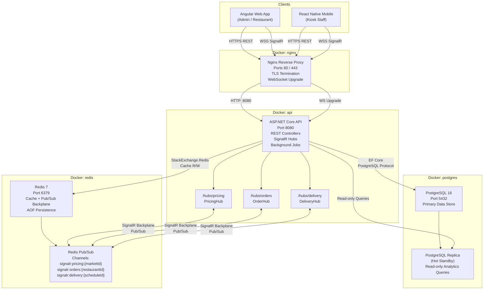
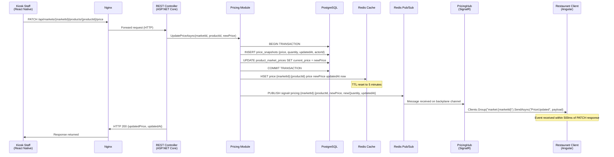

# FreshFlow (FFX) — System Architecture Document

**Version:** 1.0  
**Date:** 2026-05-09  
**Project:** FreshFlow – Intermediary Platform for Food Procurement and Logistics Optimization  
**Status:** Approved for Implementation  
**Based on:** Requirements Specification v1.0

---

## Table of Contents

1. [Architecture Overview](#1-architecture-overview)
2. [Component Diagram](#2-component-diagram)
3. [Module Breakdown](#3-module-breakdown)
4. [Real-Time Architecture](#4-real-time-architecture)
5. [Caching Strategy](#5-caching-strategy)
6. [Technology Decisions Log](#6-technology-decisions-log)
7. [Deployment Architecture](#7-deployment-architecture)

---

## 1. Architecture Overview

### 1.1 Pattern Choice: Modular Monolith

FreshFlow's backend is designed as a **Modular Monolith** — a single deployable ASP.NET Core application internally structured into seven discrete, loosely-coupled modules with enforced boundaries at the code level.

**Justification:**

- **Small team, capstone scope.** A distributed microservices architecture introduces significant operational overhead (service discovery, distributed tracing, network fault handling, inter-service authentication) that is not warranted for a team of this size building a capstone project.
- **Single deployment unit.** One Docker container, one CI/CD pipeline step, one connection pool — operational simplicity is preserved while module boundaries are enforced in code.
- **Clean module boundaries without distributed complexity.** Each module owns its own data, exposes internal services via C# interfaces (not HTTP), and communicates cross-module only via domain events or injected service abstractions. This discipline makes future extraction to microservices tractable.
- **Evolutionary path.** If traffic demands require horizontal scaling beyond what a single process can handle, individual modules can be extracted into separate services. The data ownership rules established now prevent the tight coupling that makes such extraction painful.

**Accepted trade-off:** All modules share the same PostgreSQL connection pool and process memory. A runaway query in Analytics could theoretically starve the Auth module. This is mitigated by query timeouts, read replicas for Analytics, and the relatively low concurrent load expected in Phase 1 (500 simultaneous REST users, 200 WebSocket connections).

---

### 1.2 System Components and Responsibilities

| Component | Type | Responsibility |
|-----------|------|---------------|
| **Angular Web App** | Frontend (SPA) | Admin and Restaurant user interface. Displays live price boards, order management UI, analytics dashboards, and logistics scheduling views. Communicates with the backend via HTTPS REST and SignalR WebSocket. |
| **React Native Mobile App** | Frontend (Mobile) | Kiosk Staff interface for real-time price and quantity updates at wholesale markets. Receives price broadcast confirmations. Communicates with the backend via HTTPS REST and SignalR WebSocket. |
| **ASP.NET Core API** | Backend (Modular Monolith) | Single process hosting all seven feature modules, the SignalR hub endpoints, background job runners (Hangfire or hosted services), EF Core data access, Redis client, and all REST controllers. |
| **PostgreSQL 16** | Primary Database | Source of truth for all persistent data: users, products, price history, orders, routes, schedules, hubs, vehicles. Accessed via EF Core from the API process. |
| **Redis 7** | Cache + Pub/Sub Backplane | Stores current price/quantity cache (Hash), soft-reservation counters, computed route cache, analytics aggregation cache, and serves as the SignalR scale-out backplane (Pub/Sub channels). |
| **Nginx** | Reverse Proxy | Terminates TLS, forwards HTTPS traffic to the API container, handles WebSocket upgrade (`Upgrade: websocket`) for SignalR, serves static Angular build artifacts, enforces HTTP→HTTPS redirect. |
| **Background Job Runner** | Hosted Service (in-process) | Runs inside the ASP.NET Core process as `IHostedService` workers. Responsible for: scheduled order instance generation (60-second tick), soft-reservation expiry (5-minute tick), async analytics export processing, analytics pre-aggregation. |

---

### 1.3 Client Interaction Model

**Angular Web App (Admin and Restaurant users):**
- Bootstrapped as a single-page application served via Nginx from pre-built static files.
- All API calls are made over HTTPS REST to `/api/*` endpoints, routed through Nginx to the ASP.NET Core container.
- Establishes a persistent SignalR WebSocket connection to the relevant hubs (`/hubs/pricing`, `/hubs/orders`, `/hubs/delivery`) upon login. The connection is authenticated via the JWT access token passed in the `access_token` query string parameter during the SignalR negotiate handshake.
- On reconnect, Angular re-executes the hub join calls (e.g., `HubConnection.invoke("JoinMarketGroup", marketId)`) and re-fetches current state via REST.
- Restaurant users join `market:{marketId}` groups (for price updates) and `restaurant:{restaurantId}` groups (for order/delivery events).
- Admin users join `admin:all` group for cross-restaurant order monitoring.

**React Native Mobile App (Kiosk Staff users):**
- Communicates with the same ASP.NET Core API over HTTPS REST for price and quantity updates (`PATCH /api/markets/{marketId}/products/{productId}/price` and `/quantity`).
- Establishes a SignalR WebSocket connection to `/hubs/pricing` upon login to receive price update broadcast confirmations.
- Kiosk Staff join `kiosk:{marketId}` group and are restricted by server-side policy to their assigned market only.
- On reconnect, the mobile app uses exponential backoff (initial: 1 s, max: 30 s) before re-establishing the connection and re-joining groups.
- REST calls use the JWT access token in the `Authorization: Bearer` header; token refresh is handled automatically by an Axios/Fetch interceptor before the access token expires.

---

## 2. Component Diagram

### 2.1 System Component Diagram



### 2.2 Real-Time Pricing Update Flow (Sequence Diagram)



---

## 3. Module Breakdown

### 3.0 Clean Architecture per Module (Microservice-Ready)

Each of the seven modules is a **separate set of .NET projects** following Clean Architecture layer rules. The structure is designed so that any module can be extracted into an independent microservice with only three changes: (1) promote its Infrastructure project's `AddXModule()` to a standalone `Program.cs`, (2) swap MediatR integration-event handlers for a message bus consumer (e.g., RabbitMQ), and (3) split the shared `AppDbContext` into a per-module context.

#### Project dependency rules (enforced by .csproj references)

```
Domain        →  SharedKernel only
Application   →  Domain + SharedKernel + Contracts
Infrastructure→  Application + Domain + EF Core packages + Redis packages
API (host)    →  all Infrastructure projects (for DI registration only)
```

No module's Domain or Application project may reference another module's projects. All cross-module coupling goes through `FreshFlow.Contracts` (integration events) consumed via MediatR `INotificationHandler<T>`.

#### Cross-module communication pattern

```
                    ┌─────────────────────────────────┐
   Orders module    │  OrderService publishes          │
                    │  OrderCreatedDomainEvent         │
                    │  (internal, via MediatR)         │
                    │         ↓                        │
                    │  OrderCreatedDomainEventHandler  │
                    │  publishes integration event:    │
                    │  OrderCreatedIntegrationEvent    │  ←── defined in FreshFlow.Contracts
                    └─────────────────────────────────┘
                                     ↓
   Logistics module  OrderCreatedIntegrationEventHandler  (INotificationHandler)
   Notifications     NotificationOnOrderCreatedHandler   (INotificationHandler)
```

In-process MediatR handles both domain and integration events with zero latency. When a module is extracted to a microservice, replace the MediatR `Publish` call with a message bus `Publish`, and replace handlers with message bus consumers — no other module code changes.

#### Shared projects

| Project | Purpose |
|---|---|
| `FreshFlow.SharedKernel` | `BaseEntity`, `AggregateRoot`, `ValueObject`, `IDomainEvent`, `Result<T>`, `Error`, `ICommand`, `IQuery` |
| `FreshFlow.Contracts` | Integration event records (cross-module DTOs): `OrderCreatedIntegrationEvent`, `PriceUpdatedIntegrationEvent`, etc. References SharedKernel only. |

#### Database strategy

A single `AppDbContext` is used for the monolith phase. Each module's Infrastructure project contributes entity type configurations via `IEntityTypeConfiguration<T>` — the AppDbContext scans and applies all of them at startup. Migrations are centralized. Upon microservice extraction: create a module-scoped `DbContext` using the module's existing `IEntityTypeConfiguration` classes and generate fresh migrations.

---

The ASP.NET Core application host wires all seven modules together. Each module's Infrastructure project exposes an `AddXModule(this IServiceCollection services, IConfiguration config)` extension method that registers all its internal services, repositories, background jobs, and EF entity configurations. The host's `Program.cs` calls each of these and nothing else.

---

### 3.1 Auth Module

**Responsibility:** Manages all aspects of user identity — JWT issuance, refresh token lifecycle, role-based claims, and user account administration.

**Internal Components:**
- `AuthController` — endpoints: `POST /api/v1/auth/login`, `POST /api/v1/auth/refresh`, `POST /api/v1/auth/logout`
- `AdminUsersController` — endpoints: `POST /api/v1/admin/users`, `PATCH /api/v1/admin/users/{id}/activate`, `PATCH /api/v1/admin/restaurants/{restaurantId}/approve`
- `TokenService` — generates signed JWT access tokens and cryptographically random refresh tokens; enforces TTL (access: 15 min, refresh: 7 days)
- `RefreshTokenRepository` — persists and queries the `refresh_tokens` table; implements token rotation and family invalidation logic
- `PasswordService` — wraps BCrypt with work factor ≥ 12 for hashing and verification
- `UserRepository` — CRUD against the `users` table
- `AuthPolicies` — defines ASP.NET Core authorization policies mapping roles to endpoint groups

**External Dependencies:** None. The Auth module has no runtime dependencies on other modules. All other modules depend on Auth (for the `[Authorize]` attribute and role claims) but Auth does not call any other module.

**Data Owned:**
- `users` — user accounts with role, email, password hash, status (`ACTIVE`, `PENDING_APPROVAL`, `INACTIVE`)
- `refresh_tokens` — refresh token records with `token_hash`, `user_id`, `family_id`, `expires_at`, `revoked_at`, `replaced_by_token_id`
- `user_market_assignments` — maps Kiosk Staff users to their assigned Market(s)

**Cross-Module Rules:**
- The Auth module must NOT contain any business logic from other domains (no pricing logic, no order validation, no logistics calculations).
- The Auth module must NOT directly emit SignalR events. It may raise a domain event (`UserLoggedIn`, `UserLoggedOut`) that the Notifications module can subscribe to if needed.
- Token validation logic (JWT signature verification, claim extraction) must be implemented as ASP.NET Core middleware and accessible to all modules without importing Auth module internals.
- The Auth module must NOT store refresh tokens in Redis — they must be persisted in PostgreSQL for auditability and family-invalidation correctness.

---

### 3.2 Pricing Module

**Responsibility:** Manages the product catalog, current price and quantity state per market, price snapshot history, and triggers real-time broadcast events on every price or quantity change.

**Internal Components:**
- `ProductsController` — `GET /api/products`, `POST /api/admin/products`, `PATCH /api/admin/products/{id}`, `DELETE /api/admin/products/{id}`
- `MarketPricingController` — `PATCH /api/markets/{marketId}/products/{productId}/price`, `PATCH /api/markets/{marketId}/products/{productId}/quantity`, `GET /api/markets/{marketId}/products`, `GET /api/markets/{marketId}/products/{productId}/price-history`
- `PricingService` — core business logic: validates price/quantity values, enforces market assignment, applies optimistic concurrency check (`If-Unmodified-Since`), writes price snapshot, updates Redis cache, triggers broadcast
- `PriceSnapshotRepository` — append-only writes to `price_snapshots`; read with pagination for history queries
- `ProductMarketPriceRepository` — manages the `product_market_prices` table (current price per product per market)
- `ProductRepository` — manages the `products` catalog table
- `PricingCacheWriter` — encapsulates all Redis Hash writes for price and quantity; handles Redis failure gracefully (logs error, does not roll back PostgreSQL write for cache-only failures)

**External Dependencies:**
- **Notifications Module** (via `IPricingBroadcastService` interface) — to publish `PriceUpdated` SignalR events after a successful database write

**Data Owned:**
- `products` — product catalog (name, unit, category, description, status)
- `product_market_prices` — current price and quantity per `(product_id, market_id)` pair; includes `updated_at` for optimistic concurrency
- `price_snapshots` — immutable append-only history of every price/quantity change event
- `markets` — wholesale market definitions (name, location, active status)
- `system_config` — key-value store for Admin-configurable parameters (e.g., `daily_order_cutoff_time`, `price_band_tolerance_percent`)

**Cross-Module Rules:**
- The Pricing module must NOT read from order tables or logistics tables.
- The Pricing module must NOT call the SignalR hub directly. It must call the Notifications module's published interface (`IPricingBroadcastService`) which is registered in DI.
- The Pricing module must NOT skip the PostgreSQL write in favor of only updating Redis. Redis is a cache; the database is the source of truth.
- The Pricing module must NOT allow deletion of price snapshot records. The repository must expose only append and read operations.

---

### 3.3 Orders Module

**Responsibility:** Manages the complete lifecycle of restaurant orders — creation (one-off and scheduled), line item validation, soft-reservation, status transitions, order grouping, and history.

**Internal Components:**
- `OrdersController` — `POST /api/orders`, `GET /api/orders/{orderId}`, `GET /api/orders`, `PATCH /api/orders/{orderId}/cancel`
- `ScheduledOrdersController` — `POST /api/orders/scheduled`, `GET /api/orders/scheduled/{id}/instances`
- `AdminOrderGroupsController` — `POST /api/v1/admin/order-groups`, `POST /api/v1/admin/order-groups/auto-batch`, `GET /api/v1/admin/order-groups/{id}`
- `AdminOrdersController` — `GET /api/admin/orders`
- `OrderService` — orchestrates order creation: validates line items against active products, checks and applies soft-reservations in Redis, writes order to PostgreSQL atomically, triggers `OrderCreated` domain event
- `OrderStatusService` — transitions order status through the state machine (`PENDING → CONFIRMED → IN_TRANSIT → DELIVERED`, and `→ CANCELLED` from PENDING/CONFIRMED); triggers `OrderStatusChanged` domain event on each transition
- `ScheduledOrderService` — manages `scheduled_orders` definitions; generates order instances on the correct cron tick; implements missed-execution recovery; enforces idempotency via a `last_executed_at` timestamp
- `SoftReservationService` — Redis-backed: decrements available quantity key on order creation; rolls back on order failure; releases expired reservations (called by background job)
- `OrderBatchingService` — shared by the 22:00 scheduled job and Admin manual trigger; groups eligible `CONFIRMED` orders by source market (delivery-zone grouping from FR-ORD-005 is not implemented — no restaurant-to-zone link); supports `dryRun`, `targetDate`, and idempotent skip behavior
- `OrderGroupService` — validates manually adjusted `order_groups`; enforces single-group constraint per order
- `OrderRepository` — full CRUD for `orders` and `order_line_items`
- `ScheduledOrderRepository` — CRUD for `scheduled_orders` and `scheduled_order_instances`
- `OrderGroupRepository` — manages `order_groups` and `order_group_members`
- `ReservationExpiryJob` — `IHostedService` background job; runs every 5 minutes; identifies and releases soft-reservations older than 30 minutes; idempotent by design

**External Dependencies:**
- **Pricing Module** (via `IProductCatalogReader` interface) — to validate that line item `productId` values reference active products and to read current available quantity before applying soft-reservations
- **Notifications Module** (via `IOrderBroadcastService` interface) — to push `OrderStatusChanged` and `OrderGrouped` events via SignalR on status changes

**Data Owned:**
- `orders` — order headers (restaurant_id, status, created_at, scheduled_order_id)
- `order_line_items` — line items (order_id, product_id, market_id, requested_quantity, unit_price_at_order_time)
- `scheduled_orders` — recurrence definitions (restaurant_id, recurrence_type, first_run_at, last_executed_at, cancelled_at)
- `scheduled_order_instances` — links between scheduled_orders and generated concrete orders
- `order_groups` — group headers (created_by_admin_id, created_at, status)
- `order_group_members` — join table (order_group_id, order_id)

**Cross-Module Rules:**
- The Orders module must NOT directly query logistics tables (routes, schedules, vehicles). Logistics information is injected via domain events or passed as references.
- The Orders module must NOT hard-deduct stock from a PostgreSQL inventory table — stock management at the market level belongs to the Pricing module. Soft-reservation is managed in Redis by this module.
- The Orders module must NOT call the Hub module's internal services directly. Hub inbound/outbound tracking is triggered by Logistics or Hub module events.
- Scheduled order generation must be idempotent — the job checks `last_executed_at` and the current tick window before inserting a new instance.

---

### 3.4 Logistics Module

**Responsibility:** Calculates and stores optimized delivery routes, manages the vehicle fleet registry, creates and tracks delivery schedules, and coordinates the assignment of order groups to scheduled routes.

**Internal Components:**
- `LogisticsRoutesController` — `POST /api/logistics/routes/calculate`, `POST /api/logistics/routes/{routeId}/assign-vehicle`
- `LogisticsSchedulesController` — `POST /api/logistics/schedules`, `GET /api/logistics/schedules`, `PATCH /api/logistics/schedules/{id}`
- `AdminVehiclesController` — `POST /api/admin/vehicles`, `GET /api/admin/vehicles`, `PATCH /api/admin/vehicles/{id}`
- `RouteCalculationService` — implements the simplified VRP solver: accepts stops (markets, hubs, restaurants) and optimization criterion (`DISTANCE`, `TIME`, `COST`); delegates to `VrpSolver`; enforces 20-stop limit; computes estimated distances, durations, and costs per stop
- `VrpSolver` — nearest-neighbor heuristic with 2-opt improvement for up to 20 stops; returns ordered stop sequence with estimates. Note: Google OR-Tools is the preferred upgrade path if accuracy becomes insufficient (see Technology Decisions Log)
- `RouteRepository` — persists calculated `delivery_routes` and `route_stops`; supports hash-based cache key lookup for computed routes
- `DeliveryScheduleService` — creates `delivery_schedules` linking a route, a vehicle, and a departure time; validates vehicle capacity against total order group weight; enforces conflict detection for vehicle double-booking
- `DeliveryScheduleRepository` — CRUD for `delivery_schedules`; supports date-range queries
- `VehicleRepository` — manages `vehicles` table; enforces active-status and conflict constraints
- `RouteCache` — Redis-backed cache for computed routes using `route:{hash(stops)}` key; TTL 1 hour; invalidated on vehicle re-assignment or stop-list change

**External Dependencies:**
- **Orders Module** (via `IOrderGroupReader` interface) — to read order group membership and total weights when validating capacity for a delivery schedule
- **Hub Module** (via `IHubAvailabilityReader` interface) — to check hub capacity and active status during route calculation
- **Notifications Module** (via `IDeliveryBroadcastService` interface) — to push `DeliveryStatusChanged` and `RouteOptimized` events when schedule status changes

**Data Owned:**
- `delivery_routes` — route records (optimization_criterion, route_type, total_distance_km, total_duration_min, estimated_cost_vnd, created_at)
- `route_stops` — ordered stop list per route (stop_order, entity_type, entity_id, estimated_arrival_at, estimated_departure_at)
- `delivery_schedules` — schedule records (route_id, vehicle_id, order_group_id, planned_departure_at, status, actual_departure_at, actual_arrival_at)
- `vehicles` — vehicle registry (plate_number, capacity_kg, vehicle_type, status)

**Cross-Module Rules:**
- The Logistics module must NOT directly read or write order status fields. Order status transitions are the exclusive domain of the Orders module.
- The Logistics module must NOT create or modify hub inbound/outbound records. It may trigger Hub events, but hub record creation belongs to the Hub module.
- Route calculation must NOT block on database writes — the route result should be returned immediately while persistence is handled asynchronously. The cache key hash must be computed deterministically so identical requests hit cache.
- The VrpSolver must be unit-testable in isolation — it must not have any database or Redis dependencies.

---

### 3.5 Hub Module

**Responsibility:** Manages distribution hub configuration, tracks inbound and outbound goods movements, supports cross-docking operations, and provides redistribution suggestions.

**Internal Components:**
- `AdminHubsController` — `POST /api/admin/hubs`, `GET /api/admin/hubs`, `PATCH /api/admin/hubs/{hubId}`
- `HubInboundController` — `POST /api/hubs/{hubId}/inbound`, `GET /api/hubs/{hubId}/inbound`
- `HubOutboundController` — `POST /api/hubs/{hubId}/outbound`, `GET /api/hubs/{hubId}/outbound`
- `CrossDockController` — `POST /api/hubs/{hubId}/cross-dock`, `GET /api/hubs/{hubId}/cross-dock`
- `RedistributionController` — `GET /api/hubs/{hubId}/redistribution-suggestions`
- `HubService` — manages hub lifecycle; enforces capacity constraints; blocks deactivation of hubs with pending deliveries
- `InboundTrackingService` — records inbound events; validates against delivery schedule; updates `occupied_capacity_kg`; enforces `ALREADY_RECEIVED` constraint
- `OutboundTrackingService` — records outbound events; validates available hub stock per product; updates `occupied_capacity_kg`
- `CrossDockService` — validates inbound delivery status (`ARRIVED_AT_HUB`) and hub alignment; creates cross-dock records
- `RedistributionSuggestionService` — reads current hub stock and pending orders (via `IOrderGroupReader`), applies priority rules (oldest pending order first, delivery urgency), returns advisory suggestions within 2-second SLA
- `HubRepository` — CRUD for `hubs` table including capacity calculations
- `InboundRepository` — append-heavy writes and date-filtered reads for `hub_inbound_events`
- `OutboundRepository` — append-heavy writes and date-filtered reads for `hub_outbound_events`
- `HubStockRepository` — maintains `hub_stock` materialized view of current product quantities per hub
- `CrossDockRepository` — CRUD for `cross_dock_transfers`

**External Dependencies:**
- **Orders Module** (via `IOrderGroupReader` interface) — to query pending order weights and priorities for redistribution suggestions
- **Logistics Module** (via `IDeliveryScheduleReader` interface) — to validate delivery schedule status when recording inbound events and cross-dock transfers

**Data Owned:**
- `hubs` — hub registry (name, address, latitude, longitude, capacity_kg, status)
- `hub_inbound_events` — inbound goods records per hub (source_market_id, delivery_schedule_id, arrived_at, items: product_id + quantity_kg)
- `hub_outbound_events` — outbound goods records per hub (destination_route_id, dispatched_at, items: product_id + quantity_kg)
- `hub_stock` — running stock balance per (hub_id, product_id); updated transactionally on inbound/outbound events
- `cross_dock_transfers` — cross-dock records (hub_id, inbound_delivery_id, outbound_route_id, status)

**Cross-Module Rules:**
- The Hub module must NOT read from `orders` or `order_line_items` tables directly. It reads order data exclusively via the `IOrderGroupReader` interface provided by the Orders module.
- The Hub module must NOT calculate delivery routes. Route calculation belongs to the Logistics module.
- Hub stock updates (`hub_stock`) must be performed within the same database transaction as the inbound or outbound event record — they must never diverge.
- The Hub module must NOT expose hub capacity information to the UI directly for capacity planning; that belongs to Analytics.

---

### 3.6 Analytics Module

**Responsibility:** Provides read-only aggregated data for dashboards and exports. All queries run against read replicas or pre-aggregated tables and must never block operational write paths.

**Internal Components:**
- `PriceTrendsController` — `GET /api/analytics/price-trends`
- `DemandHeatmapController` — `GET /api/analytics/demand-heatmap`, `GET /api/analytics/demand-heatmap/time-distribution`
- `DeliveryPerformanceController` — `GET /api/analytics/delivery-performance`, `GET /api/analytics/delivery-performance/by-route`
- `ExportController` — `GET /api/analytics/export/price-history`, `GET /api/analytics/export/{jobId}/status`, `GET /api/analytics/export/{jobId}/download`
- `PriceTrendQueryService` — builds time-series queries from `price_snapshots`; aggregates by day for ranges > 12 months; computes min/max/avg/stddev statistics
- `DemandHeatmapQueryService` — aggregates order volume and value by restaurant geographic location and time bucket (hour-of-day × day-of-week matrix)
- `DeliveryPerformanceQueryService` — reads `delivery_schedules` and computes on-time rate, average duration, vehicle utilization; applies 15-minute late classification threshold
- `AnalyticsCacheService` — reads from and writes to Redis String keys (`analytics:{type}:{date}`); TTL 15 minutes; falls back to live query on cache miss
- `ExportJobService` — orchestrates async CSV export: accepts job request, enqueues background work, writes output to temporary local storage, marks job `READY`; purges files after 24 hours
- `ExportJobRepository` — tracks `export_jobs` table (job_id, type, status, requested_at, ready_at, file_path, expires_at)
- `AnalyticsAggregationJob` — `IHostedService` that runs periodically to pre-aggregate data into `analytics_aggregations` table

**External Dependencies:** None at runtime — all data is read from the PostgreSQL read replica or pre-aggregated tables. The Analytics module must not call any other module's services; it queries shared data directly from its own read views.

**Design note:** Analytics queries join across tables owned by Pricing, Orders, Logistics, and Hub modules. This is an accepted pattern for a Modular Monolith — analytics may read from any table but must never write to tables outside its own ownership. A future microservices extraction would replace these joins with an event-sourced analytics data store.

**Data Owned:**
- `analytics_aggregations` — pre-computed aggregation rows (type, period_start, period_end, data_json)
- `export_jobs` — async export job tracking

**Cross-Module Rules:**
- The Analytics module must NOT write to any table owned by another module.
- The Analytics module must NOT call other module services at runtime — it reads directly from the database (read replica preferred).
- All Analytics endpoints must be read-only — no `POST`, `PUT`, `PATCH`, or `DELETE` except for export job submission (`POST` is acceptable as it creates an export job record).
- The Analytics module must NOT trigger any SignalR events.

---

### 3.7 Notifications Module

**Responsibility:** Owns and manages all three SignalR hubs, handles client group membership (join/leave), and provides the broadcast service interfaces that other modules call to push real-time events.

**Internal Components:**
- `PricingHub` — SignalR hub at `/hubs/pricing`; manages `market:{marketId}` and `kiosk:{marketId}` group membership; broadcasts `PriceUpdated` events
- `OrderHub` — SignalR hub at `/hubs/orders`; manages `restaurant:{restaurantId}` and `admin:all` group membership; broadcasts `OrderStatusChanged` and `OrderGrouped` events
- `DeliveryHub` — SignalR hub at `/hubs/delivery`; manages `restaurant:{restaurantId}` group membership; broadcasts `DeliveryStatusChanged`, `DeliveryStarted`, `DeliveryCompleted`, and `RouteOptimized` events
- `PricingBroadcastService` — implements `IPricingBroadcastService`; called by Pricing module; publishes to `IHubContext<PricingHub>`
- `OrderBroadcastService` — implements `IOrderBroadcastService`; called by Orders module; publishes to `IHubContext<OrderHub>`
- `DeliveryBroadcastService` — implements `IDeliveryBroadcastService`; called by Logistics module; publishes to `IHubContext<DeliveryHub>`
- `HubAuthorizationFilter` — validates JWT on SignalR negotiate; enforces group access restrictions (e.g., Kiosk Staff cannot join `market:` groups for markets they are not assigned to; restaurants cannot join other restaurants' personal groups)
- `ConnectionTracker` — optional in-memory registry of active connection IDs per user for diagnostics; not relied upon for correctness (SignalR manages group membership internally)

**External Dependencies:** None. The Notifications module is a pure output channel — it receives calls from other modules via interfaces and forwards them to SignalR. It does not call other module services.

**Data Owned:** None. The Notifications module has no persistent data ownership. SignalR group state is managed internally by SignalR + Redis backplane. Connection lifecycle events are logged but not stored in a module-owned table.

**Cross-Module Rules:**
- The Notifications module must NOT contain any business logic. It must not decide when to send an event — only how to send it. The decision of when to broadcast belongs to the calling module.
- The Notifications module must NOT directly query the database to determine recipients. Recipient group names must be provided by the calling module.
- All three `IBroadcastService` interfaces must be registered in the DI container during application startup; modules inject the interface, not the concrete hub type.
- The Notifications module must NOT block the calling module's request cycle. All `SendAsync` calls to SignalR must use `fire-and-forget` dispatch (no `await` in the hot path, or dispatched to a background task).

---

## 4. Real-Time Architecture

### 4.1 SignalR Hub Design

All three hubs are authenticated — the negotiate endpoint requires a valid JWT. The token is passed via the `access_token` query string parameter during WebSocket handshake (the Authorization header is not accessible during WebSocket upgrade in browsers; query string is the standard SignalR approach).

#### PricingHub — `/hubs/pricing`

| Aspect | Detail |
|--------|--------|
| **Authentication** | Required. JWT validated on negotiate. |
| **Restaurant group** | `market:{marketId}` — joined by Restaurant clients for each market they want to track. Server-side: `await Groups.AddToGroupAsync(connectionId, $"market:{marketId}")`. |
| **Kiosk group** | `kiosk:{marketId}` — joined by Kiosk Staff clients for their assigned market. Server enforces that the `marketId` matches the user's assignment from `user_market_assignments`. |
| **Broadcasts sent** | `PriceUpdated` → to `market:{marketId}` group. |
| **Client methods invoked by server** | `PriceUpdated(productId, marketId, newPrice, newQuantity, updatedAt)` |
| **Hub methods invoked by client** | `JoinMarketGroup(marketId)`, `LeaveMarketGroup(marketId)` |

#### OrderHub — `/hubs/orders`

| Aspect | Detail |
|--------|--------|
| **Authentication** | Required. JWT validated on negotiate. |
| **Restaurant group** | `restaurant:{restaurantId}` — joined by Restaurant clients automatically on connection (restaurantId extracted from JWT `sub` claim). |
| **Admin group** | `admin:all` — joined by Admin clients only. JWT `role` claim is validated server-side. |
| **Broadcasts sent** | `OrderStatusChanged` → to `restaurant:{restaurantId}`. `OrderGrouped` → to `restaurant:{restaurantId}` for all restaurants whose orders join a group. |
| **Client methods invoked by server** | `OrderStatusChanged(orderId, previousStatus, newStatus, changedAt, estimatedDeliveryAt)`, `OrderGrouped(orderGroupId, orderId, changedAt)` |
| **Hub methods invoked by client** | None — group join is automatic based on JWT claims. |

#### DeliveryHub — `/hubs/delivery`

| Aspect | Detail |
|--------|--------|
| **Authentication** | Required. JWT validated on negotiate. |
| **Restaurant group** | `restaurant:{restaurantId}` — joined automatically based on JWT `sub` claim. |
| **Broadcasts sent** | `DeliveryStarted`, `DeliveryCompleted`, `DeliveryStatusChanged` → to `restaurant:{restaurantId}` for each restaurant whose orders are in the delivery. Per-restaurant fanout: each restaurant only receives events for its own orders even in a multi-drop delivery. |
| **Client methods invoked by server** | `DeliveryStarted(scheduleId, routeId, estimatedArrivalAt, orderIds[])`, `DeliveryCompleted(scheduleId, routeId, actualDeliveredAt, orderIds[])`, `DeliveryStatusChanged(scheduleId, newStatus, updatedAt)` |
| **Hub methods invoked by client** | None — group join is automatic based on JWT claims. |

---

### 4.2 Redis Pub/Sub for Scale-Out

When the ASP.NET Core API runs as multiple container instances (horizontal scaling), a SignalR broadcast issued on instance A can only reach clients connected to instance A. Clients connected to instance B will miss the event unless a backplane coordinates between instances.

**Why Redis as backplane:** Redis Pub/Sub allows all API instances to subscribe to shared channels. When instance A broadcasts a `PriceUpdated` event, it publishes to the Redis channel. All other instances receive the message from Redis and forward it to their locally-connected clients. This is transparent to the application code — configured at startup via `services.AddSignalR().AddStackExchangeRedis(redisConnectionString)`.

**Channel Naming Convention:**

| Channel | Purpose | Published By |
|---------|---------|-------------|
| `signalr:pricing:{marketId}` | Price and quantity update broadcasts for a specific market | PricingHub (via SignalR backplane) |
| `signalr:orders:{restaurantId}` | Order status change events for a specific restaurant | OrderHub (via SignalR backplane) |
| `signalr:delivery:{restaurantId}` | Delivery status events for a specific restaurant | DeliveryHub (via SignalR backplane) |

**Note:** The channel naming above describes the logical grouping. The ASP.NET Core SignalR Redis backplane implementation manages the actual channel names internally; the channel names listed reflect the SignalR group names that map to Redis channels. Developers do not publish to these channels directly — the backplane handles it automatically when `Clients.Group(name).SendAsync(...)` is called.

**Scale-out scenario:**
1. Kiosk Staff sends `PATCH /price` — routed by Nginx to instance A.
2. Instance A writes to PostgreSQL and Redis cache, then calls `Clients.Group("market:1").SendAsync("PriceUpdated", payload)`.
3. SignalR on instance A publishes the event to the Redis backplane channel.
4. Instance B and instance C receive the message from Redis and forward it to all their clients subscribed to `market:1`.
5. All Restaurant clients across all instances receive `PriceUpdated` within the 500 ms SLA.

---

### 4.3 WebSocket Fallback

SignalR negotiates the transport protocol automatically in the following priority order:

1. **WebSocket** (preferred) — full-duplex, lowest latency, used by default in modern browsers and React Native.
2. **Server-Sent Events (SSE)** — if WebSocket is blocked (e.g., by a corporate proxy); server-to-client only; client still uses REST for hub method invocations.
3. **Long Polling** — last resort; simulates streaming via repeated HTTP requests; higher latency but universally compatible.

**Client reconnection policy (mandatory on both Angular and React Native clients):**

```
Initial delay: 1 second
Backoff multiplier: 2x
Maximum delay: 30 seconds
Retry indefinitely until explicit logout
```

On reconnect, clients must:
1. Re-authenticate (the new connection requires a fresh JWT; if the access token has expired, refresh it first via `POST /api/auth/refresh` before reconnecting).
2. Re-invoke hub join methods (`JoinMarketGroup`, or rely on automatic group join for order/delivery hubs).
3. Re-fetch current state via REST (`GET /api/markets/{marketId}/products`, `GET /api/orders/{orderId}`) — missed events during disconnection are not retried by the server.

---

### 4.4 Connection Lifecycle

| Event | Server Behavior | Client Responsibility |
|-------|----------------|----------------------|
| **Initial connect** | SignalR validates JWT on negotiate. Accepts connection and records `connectionId`. | Send JWT in `access_token` query param. Invoke group join methods. |
| **Client joins group** | `Groups.AddToGroupAsync(connectionId, groupName)` — stored in Redis backplane. | Call hub method or rely on auto-join based on JWT claims. |
| **Disconnect (clean)** | SignalR removes `connectionId` from all groups automatically. No action needed. | Implement reconnection with exponential backoff. |
| **Disconnect (network drop)** | Same as clean disconnect — SignalR detects ping timeout and removes from groups. | Same reconnection logic. Re-fetch state via REST after reconnect. |
| **Reconnect** | New `connectionId` issued. Client must re-join groups explicitly (groups are not persisted per user). | Re-authenticate if token expired. Re-join groups. Re-fetch current state via REST. |
| **Token expiry during connection** | The existing connection remains alive until it closes — JWTs are validated only at negotiate time. | Proactively refresh the access token before the existing connection closes to avoid a gap. |

---

## 5. Caching Strategy

| Entity | Cache Location | Key Pattern | TTL | Invalidation Trigger | Notes |
|--------|---------------|-------------|-----|---------------------|-------|
| Current product price | Redis Hash | `price:{marketId}:{productId}` field `price` | 5 minutes | Kiosk Staff `PATCH /price` — `PricingCacheWriter` calls `HSET` immediately after PostgreSQL commit | On Redis miss, fall back to `product_market_prices` PostgreSQL table. Redis failure must not block the write path. |
| Current product quantity | Redis Hash | `price:{marketId}:{productId}` field `quantity` | 5 minutes (shared TTL with price) | Kiosk Staff `PATCH /quantity` — same `HSET` call as price, both fields in same Hash key | Shared Hash key with price; both fields updated atomically via `HSET price:{marketId}:{productId} price P quantity Q`. Soft-reservation decrements this value separately (see below). |
| Soft-reservation counter | Redis Hash | `reservation:{marketId}:{productId}` | 30 minutes (reservation window) | Released by `ReservationExpiryJob` after 30 minutes, or immediately on order cancellation or confirmation | Separate from the price/quantity cache key. Available quantity = quantity cache − reservation counter. |
| JWT access token validation | Stateless — no cache | N/A | N/A | N/A | JWTs are validated by signature verification (asymmetric key or HMAC shared secret). No token lookup needed. Access token revocation before expiry is not supported in v1 — 15-minute TTL is the revocation window. |
| Refresh token | PostgreSQL `refresh_tokens` table | Queried by `token_hash` (indexed) | Until `expires_at` (7 days) | Immediately invalidated on use (rotation); entire family invalidated on reuse detection; explicit `POST /api/auth/logout` | Stored in PostgreSQL, not Redis, because family invalidation and audit logging require persistent, strongly consistent storage. |
| Computed delivery route | Redis String | `route:{SHA256(sorted stops + criterion)}` | 1 hour | Vehicle re-assignment (explicit cache delete in `DeliveryScheduleService`); stop list change (key naturally changes with new hash) | The hash includes the sorted stop entity IDs and the optimization criterion. Different criteria produce different keys. Cache prevents re-computation of identical route requests. |
| SignalR group membership | SignalR internal + Redis backplane | Managed by ASP.NET Core SignalR | Session lifetime (connection lifetime) | Automatically cleared on disconnect; explicitly cleared via `Groups.RemoveFromGroupAsync` on clean leave | Not directly accessed by application code. The Redis backplane stores this state to enable multi-instance coordination. |
| Analytics aggregations | Redis String | `analytics:{type}:{date}` | 15 minutes | Data change in source tables (explicit key delete on write to relevant tables) or TTL expiry — whichever comes first | Pre-aggregated by `AnalyticsAggregationJob`. On cache miss, query falls back to `analytics_aggregations` PostgreSQL table, then to live query as last resort. Admin-only endpoints. |
| Price trend time series | Redis String | `analytics:price-trend:{productId}:{marketId}:{from}:{to}` | 15 minutes | TTL expiry or new price snapshot written for the product/market | Cached only for common dashboard date ranges. Parameterized requests with arbitrary `from`/`to` values bypass cache and query PostgreSQL read replica directly. |

---

## 6. Technology Decisions Log

| Decision | Chosen | Alternatives Considered | Reason | Trade-offs Accepted |
|----------|--------|------------------------|--------|---------------------|
| **Architecture pattern** | Modular Monolith | Microservices; Pure Monolith | Small team and capstone scope make microservices operational overhead unjustifiable. Pure monolith would create a tangled codebase with no future migration path. Modular Monolith gives clean boundaries with a single deployment unit. | All modules share CPU, memory, and DB connection pool. A poorly-behaved query can degrade other modules. Mitigated by query timeouts, read replicas for Analytics, and per-module rate limiting. |
| **Real-time transport** | SignalR (ASP.NET Core) | Raw WebSocket; Server-Sent Events; gRPC streaming | SignalR provides automatic transport negotiation (WS → SSE → Long Polling), built-in group management, JWT authentication integration, and a Redis scale-out backplane — all of which would require manual implementation with raw WebSocket. Fits naturally into the ASP.NET Core ecosystem. | SignalR adds a library dependency. gRPC streaming would be faster for binary protocols but is poorly supported in browser clients without gRPC-Web proxy layer. |
| **ORM** | EF Core 10 | Dapper; Raw SQL (Npgsql) | EF Core provides type-safe LINQ queries, automatic migration generation, change tracking, and strong ASP.NET Core integration. The query complexity in FreshFlow (mostly straightforward CRUD with some joins) does not require the fine-grained control of Dapper. | EF Core's generated SQL can be suboptimal for complex analytics queries. Mitigated by using raw SQL (`FromSqlRaw`) for the Analytics module's aggregation queries and routing those to the read replica. |
| **Primary key type** | UUID (Guid) | BIGINT serial (auto-increment) | UUIDs allow client-side ID generation (reducing round-trips), are safe to expose in URLs (no sequential enumeration), and are compatible with future distributed ID generation if modules are ever extracted. | UUID keys are 16 bytes vs. 8 bytes for BIGINT — approximately twice the index size. For FreshFlow's expected data volumes (millions of rows, not billions), this overhead is negligible. Sequential UUIDs (COMB/UUIDv7) will be used to maintain index locality and avoid excessive B-tree fragmentation. |
| **Caching layer** | Redis (StackExchange.Redis) | IMemoryCache (in-process); No cache | Redis is required for SignalR scale-out backplane regardless of caching needs, so the infrastructure cost is already paid. Redis provides shared state across multiple API instances (critical for price cache consistency under horizontal scaling). IMemoryCache would be inconsistent across instances. | Redis is a network call (adds ~1 ms latency) vs. in-memory access (nanoseconds). Redis Sentinel/Cluster adds operational complexity. Mitigated by Redis Sentinel for HA and graceful degradation to PostgreSQL on Redis failure. |
| **Routing algorithm** | Nearest-neighbor heuristic with 2-opt improvement | Google OR-Tools (exact VRP solver); Brute-force permutation | FreshFlow's route calculation is limited to ≤ 20 stops (FR-LOG-006). For this scale, a nearest-neighbor heuristic with 2-opt local search produces good-enough solutions well within the 3-second SLA without requiring a heavy external dependency (OR-Tools requires a native binary). **Trade-off is explicitly noted.** | The heuristic does not guarantee the globally optimal route. For a VRP with 20 stops, the gap from optimal is typically 5–15%. Accepted for v1. Google OR-Tools or a commercial routing API (e.g., Google Maps Directions Matrix) is the recommended v2 upgrade path if route quality becomes a business concern. |

---

## 7. Deployment Architecture

### 7.1 Docker Compose Services

| Service | Image | Ports | Depends On | Volume | Purpose |
|---------|-------|-------|------------|--------|---------|
| `nginx` | `nginx:1.27-alpine` | 80, 443 | `api` | `./nginx/nginx.conf:/etc/nginx/nginx.conf:ro`, `./certs:/etc/ssl/certs:ro` | Reverse proxy, TLS termination, static file serving (Angular build), WebSocket upgrade for SignalR |
| `api` | `freshflow-api:{sha}` | 8080 (internal only) | `postgres`, `redis` | None (stateless) | ASP.NET Core modular monolith — REST API, SignalR hubs, background jobs |
| `postgres` | `postgres:16-alpine` | 5432 (internal only) | None | `pgdata:/var/lib/postgresql/data` | Primary PostgreSQL database with AOF-equivalent WAL; data persisted on named volume |
| `redis` | `redis:7-alpine` | 6379 (internal only) | None | `redisdata:/data` | Cache, Pub/Sub backplane; AOF persistence enabled (`appendonly yes`, `appendfsync everysec`) |

**Ports exposed on host (development only):**
- `5432` for direct database access (development only; blocked in production by security group rules)
- `6379` for direct Redis access (development only)
- `80` and `443` for Nginx (all environments)

### 7.2 Docker Compose File Structure (annotated)

```yaml
# docker-compose.yml — local development + staging reference
version: "3.9"
services:

  nginx:
    image: nginx:1.27-alpine
    ports:
      - "80:80"
      - "443:443"
    volumes:
      - ./nginx/nginx.conf:/etc/nginx/nginx.conf:ro
      - ./certs:/etc/ssl/certs:ro
      - ./frontend/dist:/usr/share/nginx/html:ro   # Angular build output
    depends_on:
      - api

  api:
    image: freshflow-api:${IMAGE_SHA:-latest}
    expose:
      - "8080"
    depends_on:
      postgres:
        condition: service_healthy
      redis:
        condition: service_healthy
    environment:
      - ASPNETCORE_ENVIRONMENT
      - ConnectionStrings__DefaultConnection
      - ConnectionStrings__Redis
      - Jwt__SecretKey
      - Jwt__AccessTokenTTL
      - Jwt__RefreshTokenTTL
      - SignalR__UseRedis
      - SEED_ADMIN_EMAIL        # used only on first boot
      - SEED_ADMIN_PASSWORD     # used only on first boot

  postgres:
    image: postgres:16-alpine
    expose:
      - "5432"
    volumes:
      - pgdata:/var/lib/postgresql/data
    environment:
      - POSTGRES_DB
      - POSTGRES_USER
      - POSTGRES_PASSWORD
    healthcheck:
      test: ["CMD-SHELL", "pg_isready -U $POSTGRES_USER -d $POSTGRES_DB"]
      interval: 10s
      timeout: 5s
      retries: 5

  redis:
    image: redis:7-alpine
    expose:
      - "6379"
    volumes:
      - redisdata:/data
    command: >
      redis-server
      --appendonly yes
      --appendfsync everysec
      --requirepass ${REDIS_PASSWORD}
    healthcheck:
      test: ["CMD", "redis-cli", "-a", "${REDIS_PASSWORD}", "ping"]
      interval: 10s
      timeout: 5s
      retries: 5

volumes:
  pgdata:
  redisdata:
```

### 7.3 Environment Variables per Service

#### `api` service

| Variable | Description |
|----------|-------------|
| `ASPNETCORE_ENVIRONMENT` | `Development`, `Staging`, or `Production`. Controls Swagger visibility, detailed error messages, log verbosity. |
| `ConnectionStrings__DefaultConnection` | PostgreSQL connection string in Npgsql format. Example: `Host=postgres;Port=5432;Database=freshflow;Username=ffx;Password=...` |
| `ConnectionStrings__Redis` | Redis connection string for StackExchange.Redis. Example: `redis:6379,password=...,abortConnect=false` |
| `Jwt__SecretKey` | HMAC-SHA256 signing key for JWT. Minimum 256-bit (32 bytes). Must be stored in a secrets manager in production. |
| `Jwt__AccessTokenTTL` | Access token lifetime in seconds. Default: `900` (15 minutes). |
| `Jwt__RefreshTokenTTL` | Refresh token lifetime in seconds. Default: `604800` (7 days). |
| `SignalR__UseRedis` | `true` or `false`. When `true`, configures SignalR to use Redis backplane. Set to `false` for single-instance local development to avoid Redis dependency for SignalR. |
| `SEED_ADMIN_EMAIL` | Email address for the bootstrapped admin account (GA-010). Read once by the database seed script at startup. |
| `SEED_ADMIN_PASSWORD` | Temporary password for the bootstrapped admin account. Hashed with bcrypt work factor ≥ 12 before storage. |

#### `postgres` service

| Variable | Description |
|----------|-------------|
| `POSTGRES_DB` | Database name (e.g., `freshflow`) |
| `POSTGRES_USER` | PostgreSQL superuser username |
| `POSTGRES_PASSWORD` | PostgreSQL superuser password |

#### `redis` service

| Variable | Description |
|----------|-------------|
| `REDIS_PASSWORD` | Redis AUTH password (passed via `--requirepass` in the command). Must match the password in the API's `ConnectionStrings__Redis`. |

---

### 7.4 CI/CD Pipeline

The pipeline runs on every pull request targeting `main` and on every push to `main`. Production deployment requires a manual approval gate.

**Stages:**

| Stage | Command | Trigger | Failure Behavior |
|-------|---------|---------|-----------------|
| **1. Build** | `dotnet build --configuration Release --no-restore` | Every PR and push | Pipeline fails; no further stages run |
| **2. Restore** | `dotnet restore` | Runs before Build | Pipeline fails if packages cannot be resolved |
| **3. Unit Tests** | `dotnet test --filter Category=Unit --no-build --configuration Release` | Every PR and push | Pipeline fails; test results published as artifacts |
| **4. Integration Tests** | `dotnet test --filter Category=Integration --no-build --configuration Release` | Every PR and push | Requires Docker Compose test environment (postgres + redis containers). Pipeline fails on test failure. |
| **5. Format Check** | `dotnet format --verify-no-changes --severity error` | Every PR and push | Pipeline fails if any formatting violations are detected |
| **6. Security Scan** | `dotnet tool run dotnet-project-licenses` + OWASP dependency check | Every PR | Warnings only in v1; fail on known critical CVEs |
| **7. Docker Build** | `docker build -t freshflow-api:{git_sha} -f src/Dockerfile .` | On `main` push only (after tests pass) | Pipeline fails; image not pushed |
| **8. Push to Registry** | `docker push registry.example.com/freshflow-api:{git_sha}` | On `main` push only | Pipeline fails; deploy step skipped |
| **9. Deploy to Staging** | Rolling update: pull new image, restart `api` containers one at a time with health check gating | Automatic on `main` push after image push | Automatic rollback to previous `{git_sha}` if health check fails |
| **10. Deploy to Production** | Same rolling update as staging | Manual approval gate (authorized team members only) | Manual rollback via re-deployment of previous `{git_sha}` |

**Rolling update strategy:**
- New container starts and must pass `GET /health` (checking PostgreSQL and Redis connectivity) before traffic is shifted.
- EF Core migrations run automatically on startup via `dbContext.Database.MigrateAsync()` called in `Program.cs` before `app.Run()`. Migrations are designed to be backward-compatible (no destructive column drops in the same release as the code that removes them).
- Old container is stopped only after the new container is confirmed healthy.

---

### 7.5 Health Check Endpoint

`GET /health` — available in all environments, excluded from authentication.

**Response format:**

```json
{
  "status": "Healthy",
  "components": {
    "postgresql": { "status": "Healthy", "latencyMs": 2 },
    "redis": { "status": "Healthy", "latencyMs": 1 },
    "signalrBackplane": { "status": "Healthy" }
  },
  "timestamp": "2026-05-09T03:00:00Z"
}
```

**Degraded vs. Unhealthy:**
- `postgresql: Unhealthy` → overall status `Unhealthy`; load balancer removes the instance.
- `redis: Unhealthy` → overall status `Degraded`; load balancer keeps the instance (graceful degradation: price reads fall back to PostgreSQL, SignalR backplane falls back to single-instance mode if Redis is unavailable during a single-instance deployment).
- `signalrBackplane: Unhealthy` → overall status `Degraded` (same as Redis unhealthy, since the backplane uses Redis).

---

*End of FreshFlow System Architecture Document v1.0*

*Prepared by: System Architecture Agent | Project: FFX Capstone 2026*
