# FreshFlow Backend - System Overview Diagrams

| | |
|---|---|
| **Date** | 2026-06-26 |
| **Scope** | Backend implementation currently present in this repository |
| **Host** | `src/FreshFlow.API` |
| **Architecture style** | Modular monolith, Clean Architecture per module |
| **Draw.io source** | [`02A-system-overview-diagrams.drawio`](./02A-system-overview-diagrams.drawio) |

> `02-system-architecture.md` is the broader target architecture document. This file focuses on the backend shape that is visible in the current codebase: API host, wired modules, persistence, realtime hubs, background services, third-party integrations, and deployable containers.

---

## 1. Current System Context

FreshFlow backend is a single ASP.NET Core deployable that exposes REST APIs, SignalR hubs, hosted services, and an AI assistant orchestration layer. PostgreSQL is the durable source of truth. Redis is used by the pricing module for cache/write-through support and by the VPS stack as a shared infrastructure service.

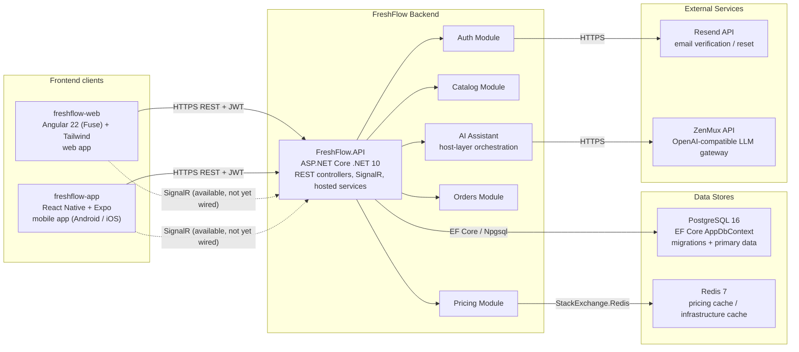

### Frontend clients

The frontends live in sibling repositories next to this backend (`../freshflow-web`, `../freshflow-app`); the backend only sees them as CORS origins and JWT-bearing REST callers.

| Repo | Tech stack | Form factor | Talks to backend via |
|---|---|---|---|
| `freshflow-web` | Angular 22 (Fuse template), TypeScript, TailwindCSS | Web app (dev `:4200`) | HTTPS REST + JWT |
| `freshflow-app` | React Native 0.81 + Expo 54 (React 19), TypeScript, axios, React Navigation, `expo-secure-store` | Mobile app (Android / iOS) | HTTPS REST + JWT |

Client integration contract:

- REST calls authenticate with `Authorization: Bearer <accessToken>`; the mobile app keeps tokens in `expo-secure-store` (not `AsyncStorage`).
- The backend exposes SignalR hubs (`/hubs/pricing`, `/hubs/orders`) for realtime, but neither frontend has wired a SignalR client yet — they currently consume REST only.
- The `AllowFrontend` CORS policy enables credentials and is restricted to `Cors:AllowedOrigins`: `appsettings.json` ships only `:4200` (Angular web); `appsettings.Development.json` widens it to extra local dev origins.
- `Email:FrontendBaseUrl` is the base URL embedded in verification / password-reset email links.

### Implemented vs referenced modules

| Area | Current status | Notes |
|---|---|---|
| Auth | Implemented and wired in `Program.cs` | JWT, refresh tokens, RBAC, registration, admin seed, password reset, email verification |
| Catalog | Implemented and wired | Markets, products, categories, units |
| Pricing | Implemented and wired | Market products, price history, quantity/price updates, Redis cache writer, SignalR broadcast |
| Orders | Implemented and wired | Draft orders, scheduled orders, credit, receipt, issues, reorder, hosted generation service |
| AI Assistant | Implemented in API host | Not a standalone module; orchestrates existing MediatR commands/queries |
| Logistics, Hub, Analytics, Notifications | Project stubs / API references only | Projects are referenced by `FreshFlow.API.csproj`, but not registered in `Program.cs` and do not currently expose runtime behavior |

---

## 2. Backend Container and Deployment View

### Local development

Local development typically runs the API from `src/FreshFlow.API` and uses Docker Compose only for PostgreSQL and Redis.

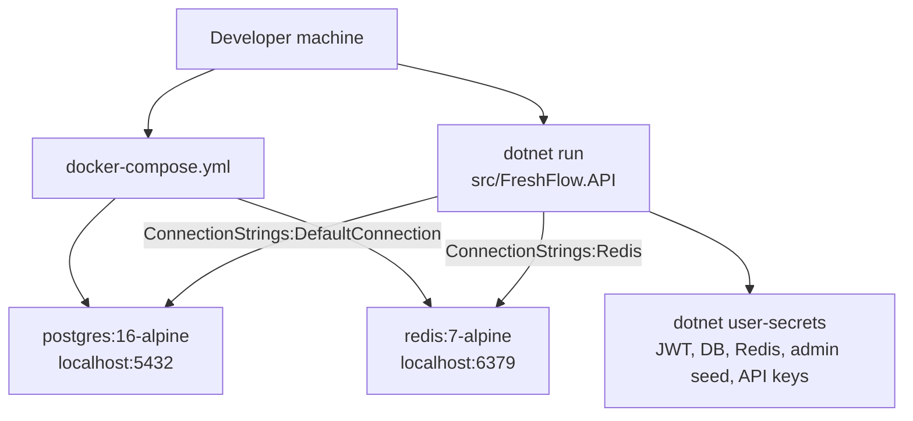

In `appsettings.Development.json`, `SignalR:UseRedis` is set to `false`, so local SignalR does not require a Redis backplane. Redis may still be needed for pricing cache paths and for parity with the VPS stack.

### Dev VPS deployment

The dev VPS pipeline is driven by `.github/workflows/cd-dev-vps.yml`. It SSHes into the VPS, hard-resets the deploy path to `origin/dev`, then runs `docker compose --env-file .env.dev-vps -f docker-compose.dev-vps.yml up -d --build --remove-orphans`.

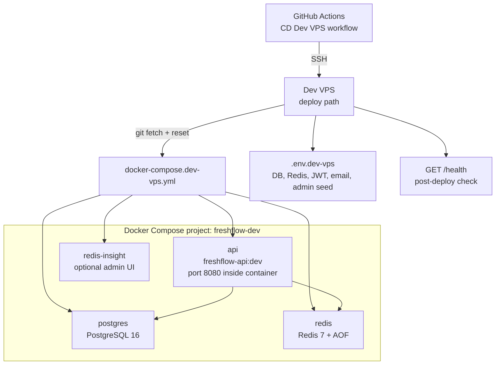

Current `docker-compose.dev-vps.yml` does not define Nginx. If a reverse proxy is used, it lives outside this compose file and should forward HTTP/WebSocket traffic to the bound API port.

---

## 3. Clean Architecture and Project Dependency View

Each implemented business module follows the same dependency direction:

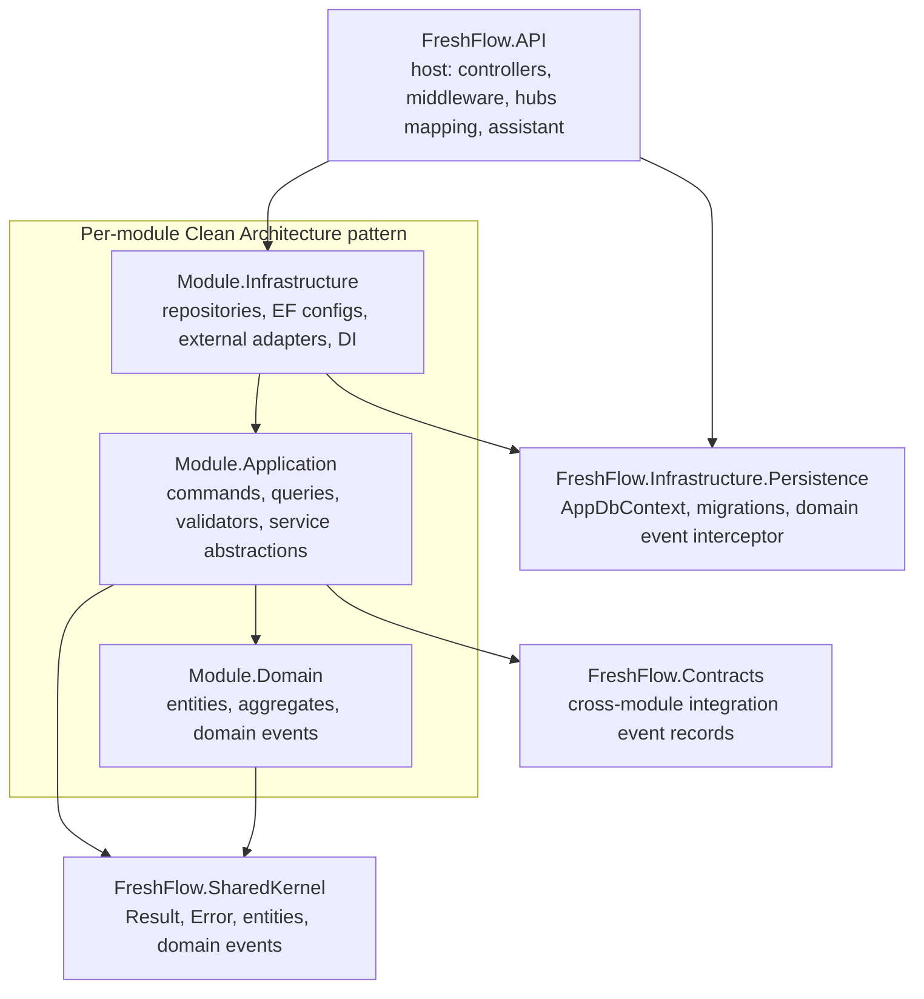

Concrete runtime wiring in `Program.cs`:

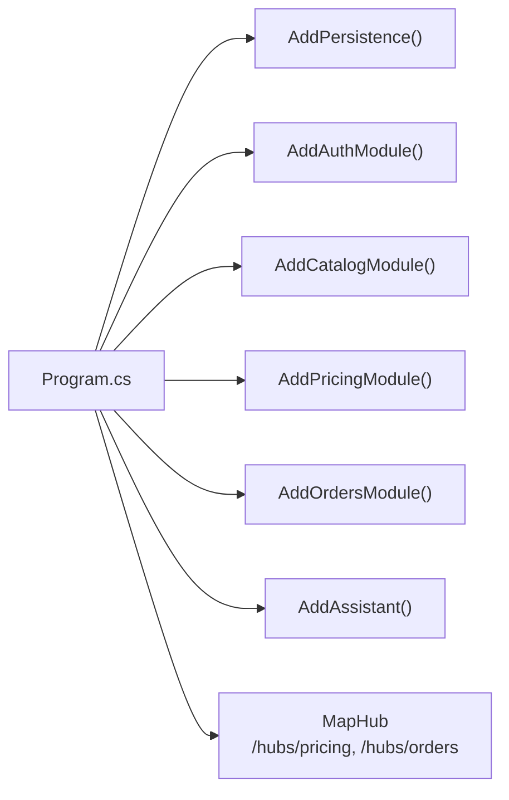

Important boundary rule: module Application/Domain projects do not reference other modules. Cross-module reads are implemented in Infrastructure using lightweight row projections against shared tables, for example:

| Consumer | Cross-module read abstraction | Reads from |
|---|---|---|
| Auth | `IMarketValidator`, `IRestaurantRepository`, `IDeliveryAddressRepository` | `markets`, `restaurants`, `delivery_addresses` |
| Pricing | `IAssignedMarketReader`, `IMarketProductReader` | `user_market_assignments`, `markets`, `products` |
| Orders | `IMarketProductReader`, `IRestaurantReader` | `market_products`, `restaurants` |

---

## 4. HTTP Request Pipeline

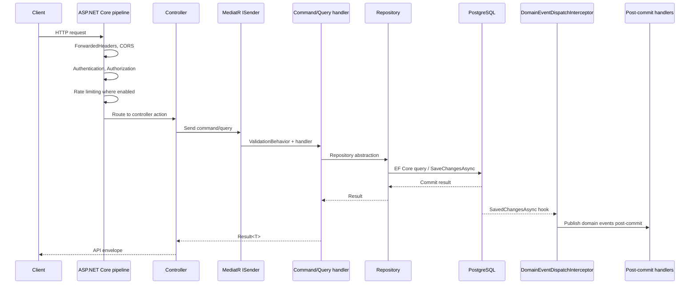

Notes:

- FluentValidation is registered per module and runs through MediatR pipeline behaviors.
- Validation exceptions are converted to a JSON API envelope by the global exception handler.
- Domain events are dispatched after successful database commit. Side-effect failures are logged and do not roll back the committed write.

---

## 5. Persistence Overview

`AppDbContext` lives in `src/FreshFlow.Infrastructure.Persistence`. It scans loaded `FreshFlow*` assemblies and applies all `IEntityTypeConfiguration<T>` classes.

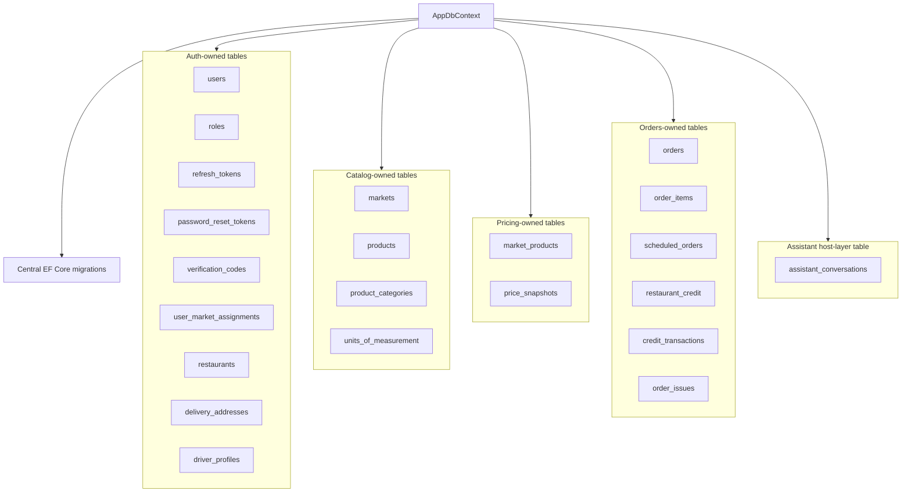

The database is shared by all modules in the monolith phase. Ownership is enforced by code boundaries, repository abstractions, and EF configuration placement, not by separate schemas.

---

## 6. Authentication and Authorization Flow

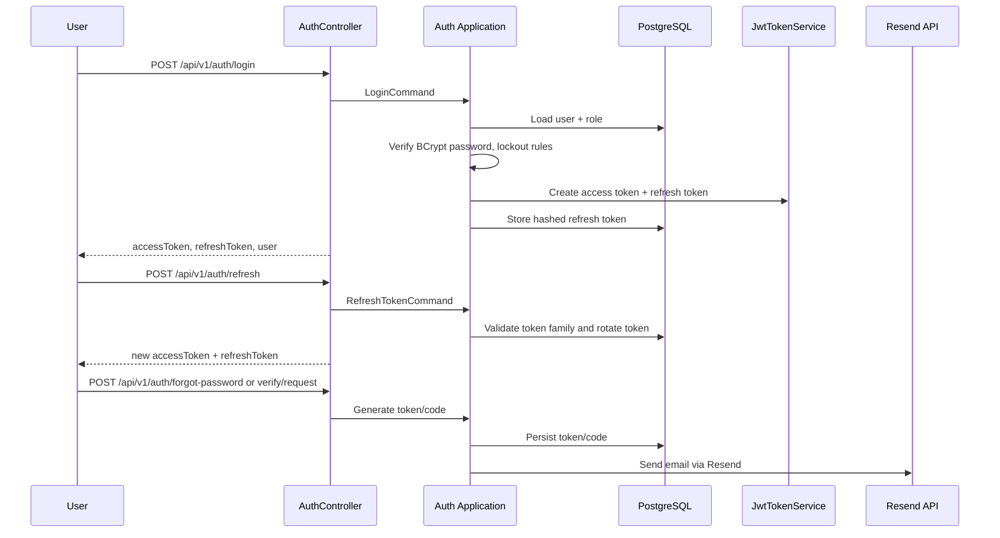

JWT behavior:

- REST calls use `Authorization: Bearer <accessToken>`.
- SignalR connections pass JWT as `access_token` query string during negotiate.
- Role checks use the `role` claim. Current roles include `admin`, `operations_manager`, `market_agent`, `hub_staff`, `driver`, and `restaurant`.
- Auth endpoints use the `auth` rate-limit policy.

---

## 7. Pricing and Realtime Price Board Flow

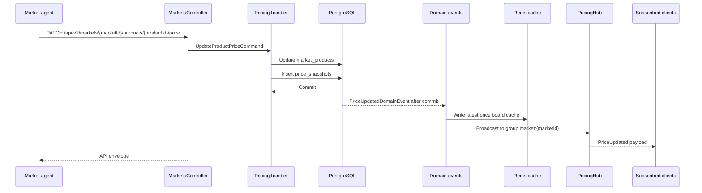

Key runtime components:

- `PricingHub` is mapped at `/hubs/pricing`.
- Clients join `market:{marketId}` through `JoinMarketAsync`.
- Non-admin clients must have an active `user_market_assignments` row for the market.
- Redis cache write failures are designed as side effects and should not undo committed price changes.

---

## 8. Orders and Credit Flow

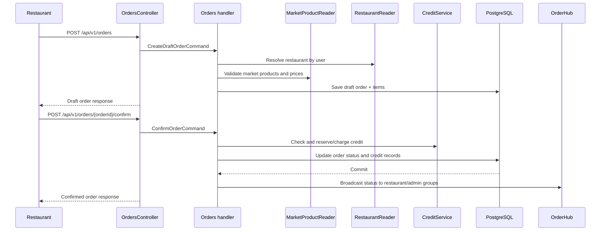

Realtime order updates:

- `OrderHub` is mapped at `/hubs/orders`.
- Restaurant users are joined to `restaurant:{restaurantId}` based on JWT subject and restaurant profile.
- Admin and operations manager users are joined to `admin:orders`.

Background processing:

- `ScheduledOrderGenerationHostedService` runs inside the API process.
- It uses `IScheduledOrderGenerationService` to generate due scheduled order instances.

---

## 9. AI Assistant Orchestration Flow

The assistant is intentionally not a separate domain module. It lives under `src/FreshFlow.API/Assistant` and orchestrates existing module commands/queries through MediatR.

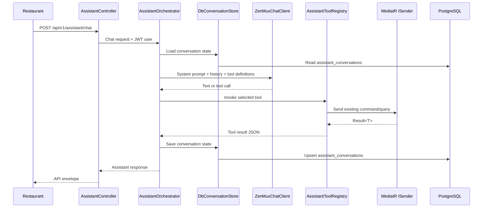

Safety constraints:

- The assistant does not access the database directly for business actions.
- Tool calls map to existing commands/queries.
- State-changing operations remain protected by module-level business rules and authorization.
- `ConfirmationGate` prevents automatic order confirmation without explicit user confirmation.

---

## 10. Controller Surface Overview

| Controller | Route prefix | Primary module / area |
|---|---|---|
| `AuthController` | `/api/v1/auth` | Auth |
| `AdminController` | `/api/v1/admin` | Auth admin + order credit admin commands |
| `ProfileController` | `/api/v1/profile` | Auth profile |
| `RestaurantProfileController` | `/api/v1/restaurants` | Restaurant profile, delivery addresses |
| `MarketsController` | `/api/v1/markets` | Catalog + pricing market product operations |
| `ProductsController` | `/api/v1/products` | Catalog |
| `CategoriesController` | `/api/v1/categories` | Catalog |
| `UnitsController` | `/api/v1/units` | Catalog |
| `PricingController` | `/api/v1/pricing` | Pricing assigned-market view |
| `OrdersController` | `/api/v1/orders` | Orders |
| `RestaurantCreditController` | `/api/v1/restaurants/{restaurantId}/credit` | Orders credit read model |
| `AssistantController` | `/api/v1/assistant` | AI assistant |

SignalR hubs:

| Hub | Path | Main groups |
|---|---|---|
| `PricingHub` | `/hubs/pricing` | `market:{marketId}` |
| `OrderHub` | `/hubs/orders` | `restaurant:{restaurantId}`, `admin:orders` |

---

## 11. Operational Dependencies

| Dependency | Used by | Purpose | Runtime requirement |
|---|---|---|---|
| PostgreSQL | All implemented modules | Primary relational data store and migrations | Required for normal API behavior; hosted seeders and handlers read/write it |
| Redis | Pricing, VPS infrastructure | Price board cache writer and shared cache service | Required for pricing cache paths; local SignalR does not use Redis backplane |
| Resend | Auth | Password reset and email verification delivery | Required for live email delivery; options validate on startup |
| ZenMux | AI Assistant | LLM chat completion through OpenAI-compatible API | Required for live assistant calls; options validate on startup |
| Docker | Local/VPS infra | Postgres, Redis, API container on VPS | Required for compose deployment |
| GitHub Actions + SSH | CD dev VPS | Deploy `dev` branch to VPS | Required for automated deployment only |

Configuration sources:

- `appsettings.json` contains non-secret defaults/placeholders.
- `appsettings.Development.json` overrides local behavior such as `SignalR:UseRedis=false`.
- `dotnet user-secrets` should provide local secrets.
- `.env.dev-vps` provides VPS container environment variables.

---

## 12. Architecture Notes and Gaps

1. The current runtime is a modular monolith, not microservices. Scaling the API scales all modules together.
2. The API project references Logistics, Hub, Analytics, and Notifications infrastructure projects, but `Program.cs` does not currently register those modules.
3. The current VPS compose stack exposes the API on localhost-bound host ports and does not include a reverse proxy service.
4. Domain events are dispatched post-commit without an outbox. This is pragmatic for the current monolith, but side effects such as SignalR or Redis writes are not retried durably after process failure.
5. Assistant conversations are stored in PostgreSQL through `assistant_conversations`; there is no separate Redis conversation store in the current implementation.
6. Redis is not used as a SignalR backplane in local development according to `appsettings.Development.json`.
