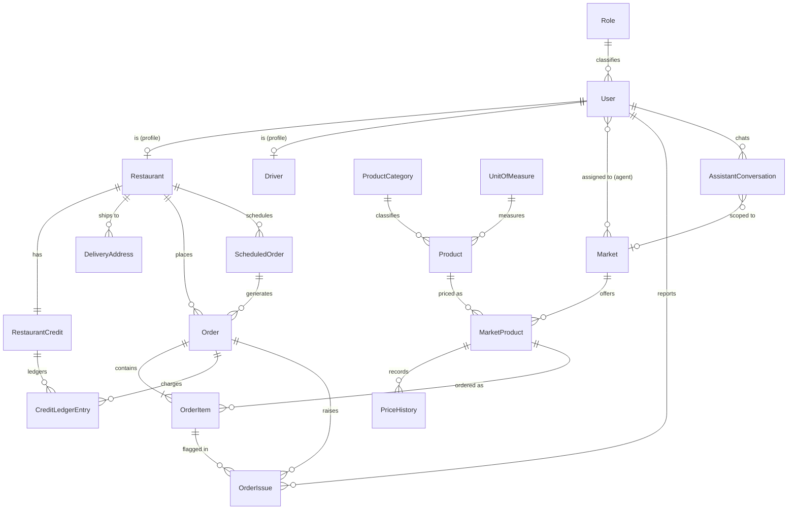
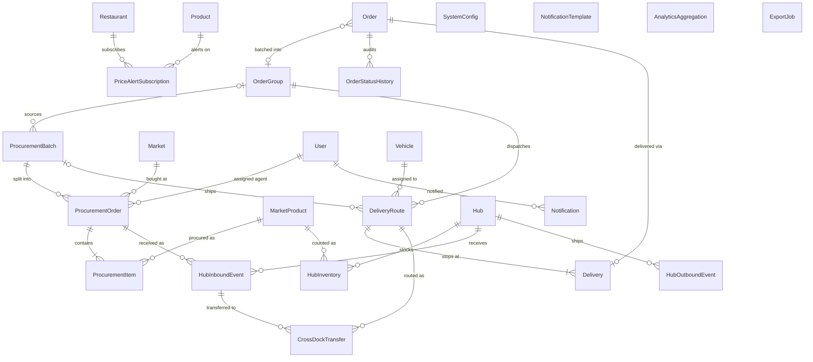

# FreshFlow (FFX) — Conceptual Data Model

> The **highest-level, most abstract** view of the FreshFlow data domain, and the first of the
> three-level modelling progression:
>
> | Level | File | Answers | Shows |
> |-------|------|---------|-------|
> | **Conceptual** (this doc) | `03-database-schema.conceptual.md` | *What business things exist and how are they related?* | Entities + relationships + cardinality. **No** attributes, keys, or types. |
> | Logical | `03-database-schema.logical.dbml` | *What data does each thing hold?* | Business attributes, PK/FK, every meaningful relationship (incl. non-enforced). Tech-agnostic. |
> | Physical | `03-database-schema.dbml` + EF migrations | *How is it stored in PostgreSQL?* | Column types, indexes, partitioning, DB defaults, enforced FK delete rules. |
>
> Reviewed against implementation on **2026-07-03**. See [`../03-database-schema.md`](../03-database-schema.md) §Sync Status for
> the authoritative implemented-vs-`[PLANNED]` list.

---

## 1. Scope & Conventions

A conceptual model is **business-readable** and deliberately omits implementation detail:

- **No attributes, primary keys, or foreign keys** — those live in the logical model.
- **No data types, indexes, partitioning, or audit/soft-delete columns.**
- **Security material is folded into its owner** — auth tokens (`refresh_tokens`,
  `password_reset_tokens`, `verification_codes`) are *credential lifecycle detail* of **User**
  and are not drawn as separate concepts here (see logical/physical models for them).
- Where several implementation tables represent one business idea, they are shown as **one concept**
  (e.g. the credit *account* + its *ledger* are two concepts because both are meaningful to the
  business: a balance and its immutable history).
- **Mapping to the logical model** (deliberate folds, so the two files can be diffed):
  **HubInboundEvent** = logical `hub_receivings` + `hub_receiving_items`;
  **Delivery** = logical `route_stops` + `deliveries`.
- **Removed by decision** (see [`../06-context-decisions.md`](../06-context-decisions.md); archived in the physical file only):
  the billing group (`invoices`, `invoice_orders`, `payments`, `refunds`) is superseded by the
  B2B credit model (**DEC-002**, see the credit-model note in §2), and `restaurant_members`
  is dropped because v1 has a single Restaurant actor, 1:1 with a User (**DEC-003**).

**Crow's-foot cardinality:** `||` one (mandatory) · `o|` zero-or-one · `o{` zero-or-many · `|{` one-or-many.

---

## 2. Conceptual ERD — Implemented Domain

### Concept glossary (implemented)

| Concept | Business meaning | Module |
|---------|------------------|--------|
| **Role** | The global capability a user holds (admin, operations_manager, market_agent, hub_staff, driver, restaurant). | Auth |
| **User** | An account. Exactly one Role. Owns its own security credentials (tokens/codes). | Auth |
| **Restaurant** | A buyer's business profile, 1:1 with a User; approval lifecycle Pending→Active. | Auth |
| **Driver** | A driver's profile, 1:1 with a User. | Auth |
| **Market** | A wholesale market where products are sold. | Catalog |
| **Product** | A catalog item, classified by Category and measured in a Unit. | Catalog |
| **ProductCategory / UnitOfMeasure** | Normalised lookups for a Product. | Catalog |
| **MarketProduct** | The *current price & available quantity* of a Product at a Market — the live price board. | Pricing |
| **PriceHistory** | Immutable record of every price/quantity change of a MarketProduct. | Pricing |
| **Order** | A restaurant's purchase, Draft→Confirmed→…→Delivered. | Orders |
| **OrderItem** | A line on an Order, with price locked at confirmation, tied to a MarketProduct. | Orders |
| **ScheduledOrder** | A recurring (daily/weekly) template that auto-generates Orders. | Orders |
| **OrderIssue** | A post-delivery discrepancy report (missing/wrong/damaged). | Orders |
| **RestaurantCredit** | The B2B credit *account* (limit + outstanding balance / công nợ) of a Restaurant. | Orders |
| **CreditLedgerEntry** | An immutable credit *movement* (charge / settlement / refund / adjustment). | Orders |
| **DeliveryAddress** | A place a Restaurant receives goods. | Auth |
| **AssistantConversation** | A stored AI-assistant chat session for a User, optionally scoped to a Market. | Assistant |

> **Note on the credit model:** FreshFlow uses **B2B credit (công nợ)**, not per-order payment
> (**DEC-002** in [`../06-context-decisions.md`](../06-context-decisions.md)). The billing concepts from the original design
> (`invoices`, `invoice_orders`, `payments`, `refunds`) are **superseded** and are therefore
> absent from the conceptual and logical models (archived in the physical file only).

---

## 3. Conceptual ERD — Planned / Roadmap Domain

These concepts belong to the approved design but are **not yet implemented** (`[PLANNED]`).
Shown separately so the implemented model above stays honest.

### Concept glossary (planned)

| Concept | Business meaning | Module |
|---------|------------------|--------|
| **PriceAlertSubscription** | A Restaurant subscribing to price-change alerts for a Product. | Pricing |
| **OrderGroup** | A batch of confirmed Orders dispatched together. | Orders |
| **OrderStatusHistory** | Audit trail of an Order's status transitions. | Orders |
| **ProcurementBatch** | One market-buying run, sourced from an OrderGroup. | Hub |
| **ProcurementOrder** | One agent's shopping assignment at one Market within a batch. | Hub |
| **ProcurementItem** | A line to buy: target vs actual quantity of a MarketProduct. | Hub |
| **Hub** | A distribution hub (cross-dock point). | Hub |
| **HubInventory** | Running stock balance of a MarketProduct at a Hub. | Hub |
| **HubInboundEvent / HubOutboundEvent** | Goods movements into/out of a Hub; inbound receives a ProcurementOrder (= logical `hub_receivings` + `hub_receiving_items`). | Hub |
| **CrossDockTransfer** | A direct inbound→outbound transfer at a Hub. | Hub |
| **Vehicle** | A delivery vehicle in the fleet. | Logistics |
| **DeliveryRoute** | A planned route with an ordered list of stops. | Logistics |
| **Delivery** | One delivery stop for one Order on a route (= logical `route_stops` + `deliveries`). | Logistics |
| **Notification** | A per-user notification record. | Notifications |
| **NotificationTemplate** | Reusable message template per event type and channel. | Notifications |
| **SystemConfig** | Admin-tunable parameters (cutoff time, price-band tolerance). | Pricing |
| **AnalyticsAggregation** | A pre-computed reporting metric. | Analytics |
| **ExportJob** | An async CSV export request and its status. | Analytics |

> `SystemConfig`, `NotificationTemplate`, `AnalyticsAggregation`, and `ExportJob` are standalone
> concepts with no business relationships to the core domain (declared as empty entities above).
> They are read/written by their own modules only.

---

## 4. Rendering

GitHub renders the `mermaid` blocks above inline. To export images for the SDD (Report 4,
§2 Database Design): paste a block into <https://mermaid.live>, or run
`mmdc -i docs/database/03-database-schema.conceptual.md -o conceptual.png`.
