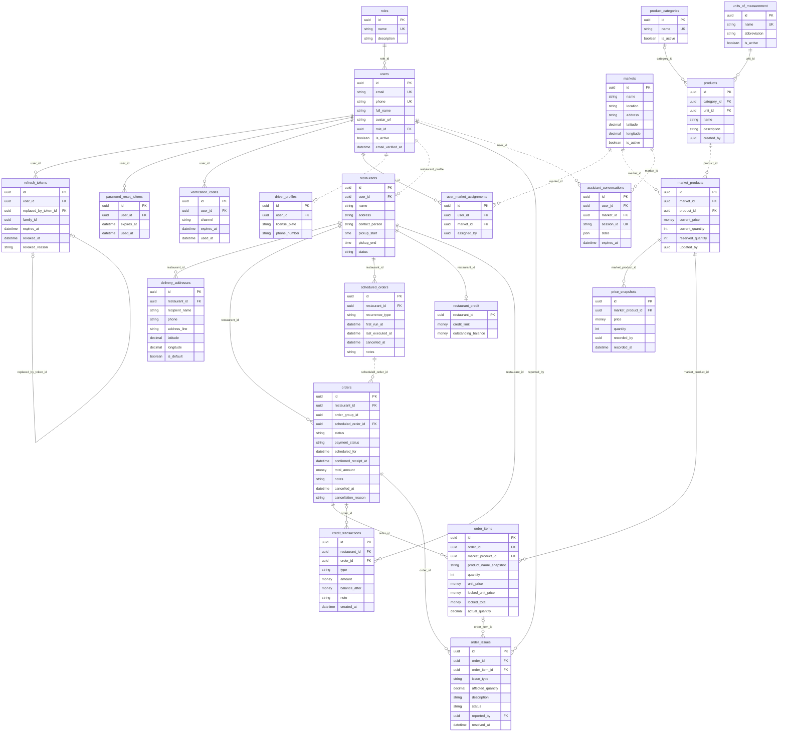

# FreshFlow Implemented Database ERD

**Source of truth:** `docs/database/03-database-schema.logical.dbml` and EF Core migrations/model snapshot.
**Scope:** implemented tables only. Planned tables are intentionally omitted.

Legend:

- Solid relationship: implemented DB relationship or enforced FK.
- Dotted relationship: logical application relationship that is not necessarily enforced by the current database schema.
- Audit-user references (`created_by`, `updated_by`, `recorded_by`, `assigned_by`) are shown as attributes only and deliberately not drawn as relationships (see the logical model for them).

