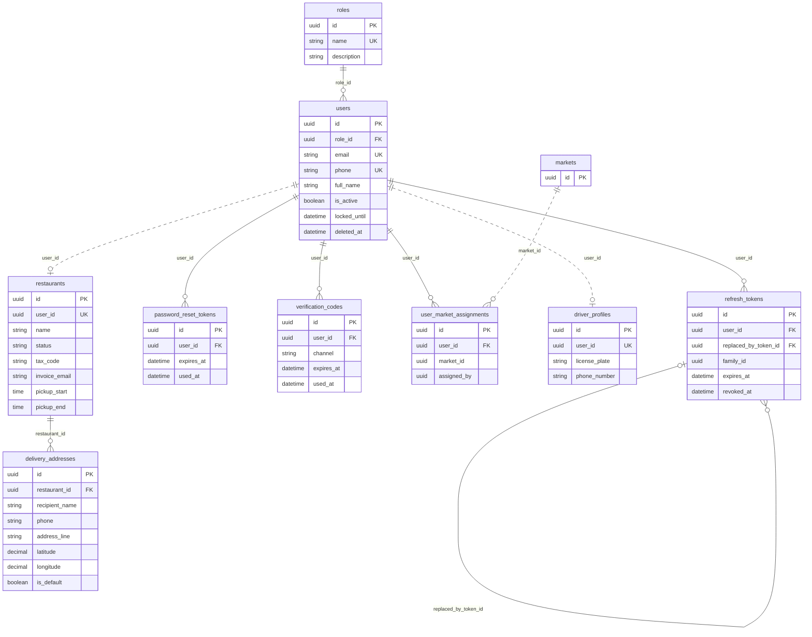
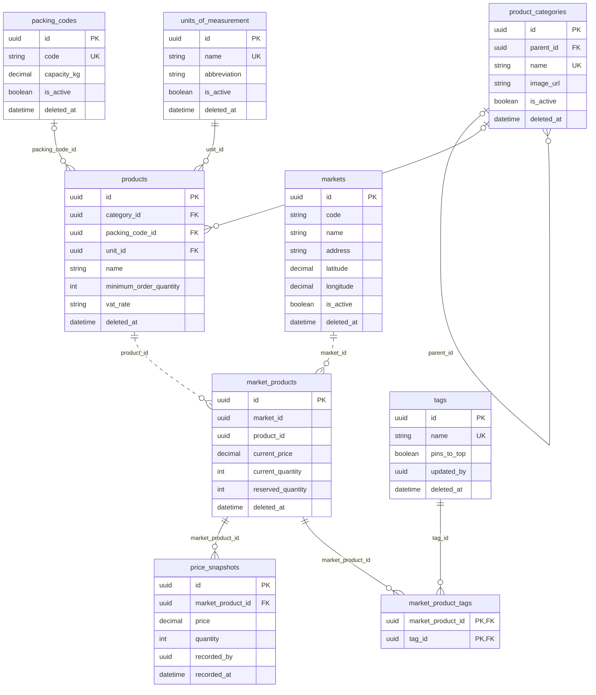
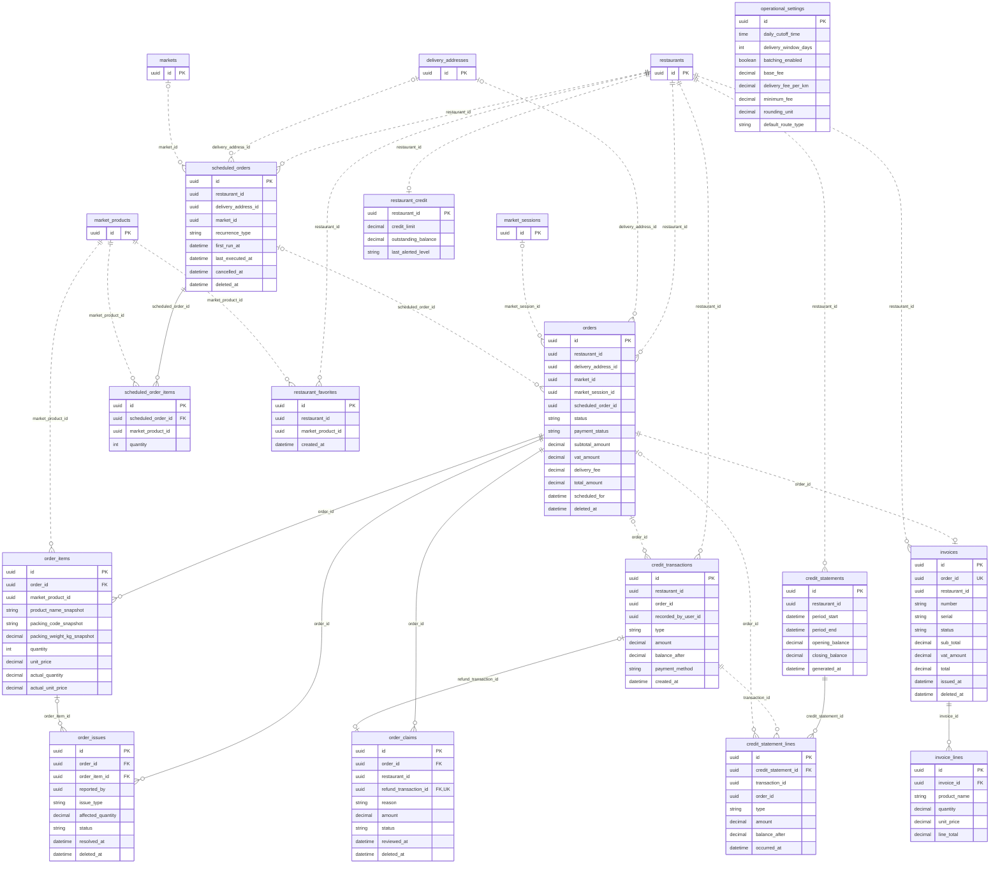
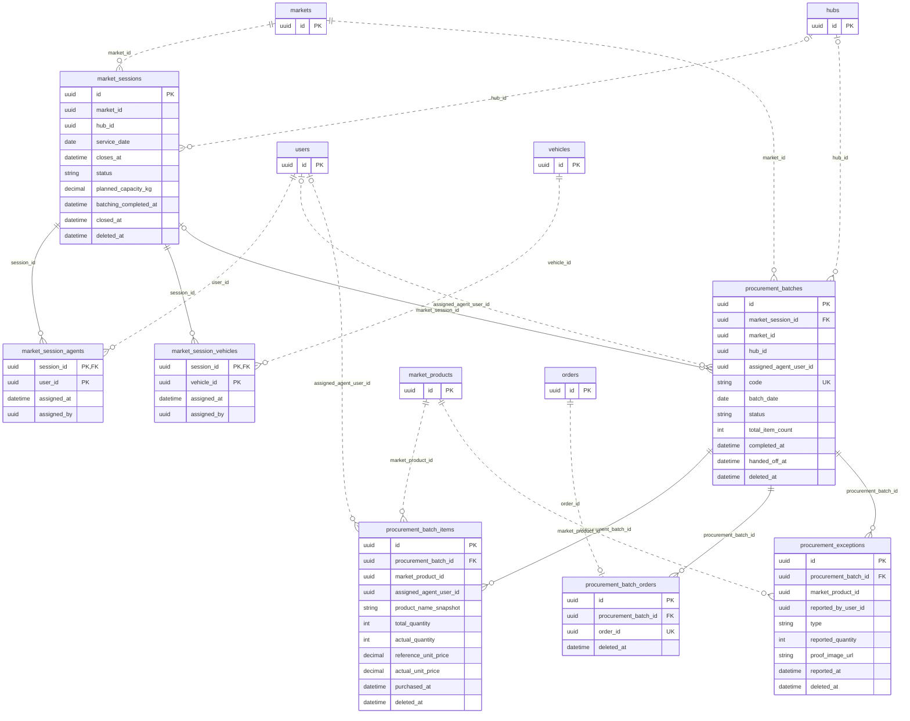
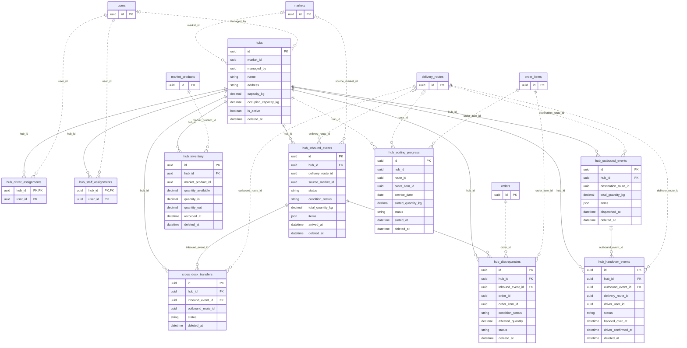
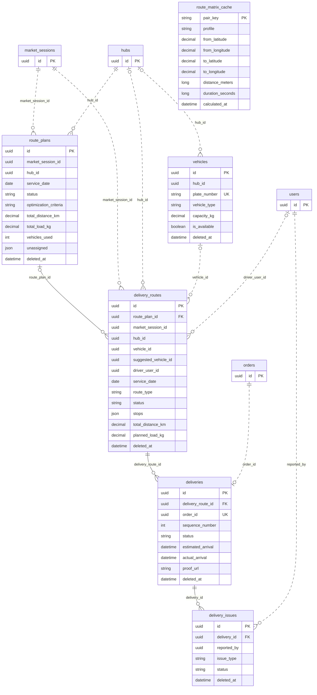
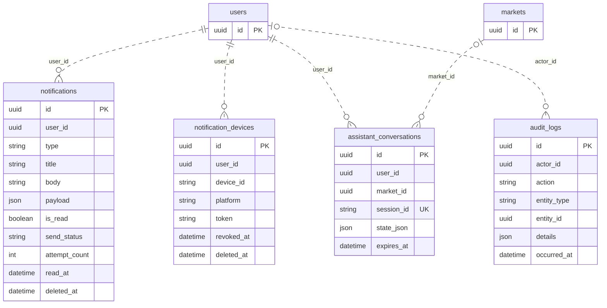

# FreshFlow Implemented Database ERD

**Reconciled:** 2026-08-16

**Source of truth:** `src/FreshFlow.Infrastructure.Persistence/Migrations/AppDbContextModelSnapshot.cs`

**Schema baseline:** through `20260814090643_AddOrderItemPackingWeightSnapshot`

This document maps the database used by the current backend. Logical names are normalized to
`snake_case`; use the EF snapshot/migrations for exact physical column casing, types, indexes,
defaults, check constraints, and delete behavior.

## Reconciliation with the previous ERD

| Module | Previous ERD | Current model | Delta |
|---|---:|---:|---:|
| Auth | 9 | 9 | 0 |
| Catalog | 4 | 5 | +1 |
| Pricing | 2 | 4 | +2 |
| Orders | 6 | 12 | +6 |
| Procurement | 0 | 7 | +7 |
| Hub | 0 | 10 | +10 |
| Logistics | 0 | 6 | +6 |
| Invoicing | 0 | 2 | +2 |
| Notifications | 0 | 2 | +2 |
| Platform | 1 | 2 | +1 |
| **Total** | **22** | **59** | **+37** |

The current EF model contains **42 enforced foreign keys**. Cross-module identifiers are mostly
intentional application-level references and therefore do not create database FK constraints.

Legend:

- Solid line (`--`): FK enforced by the current EF/database model.
- Dotted line (`..`): logical relationship only; no current database FK.
- `PK`, `FK`, and `UK`: primary key, enforced foreign key, and unique key/index.
- Audit-user fields such as `created_by`, `updated_by`, `recorded_by`, and `assigned_by` remain
  visible as attributes where useful but their dotted edges are omitted to keep diagrams readable.

## 1. Auth

## 2. Catalog and Pricing

## 3. Orders and Invoicing

## 4. Procurement

## 5. Hub

## 6. Logistics

## 7. Notifications and Platform

## Important implementation boundaries

- `hub_sorting_progress.hub_id` is not an enforced FK even though it points to `hubs`.
- Orders, Pricing, Procurement, Hub, Logistics, Notifications, Invoicing, and Platform use many
  cross-module IDs without database FKs; the dotted edges above reflect that boundary.
- `pricing_settings` is not part of the current model; it was dropped by
  `20260813074950_DropPricingSettings`. `operational_settings` remains the active singleton.
- Keyless EF query rows used by Analytics and cross-module readers are SQL projections, not tables,
  and are intentionally excluded from this ERD.
