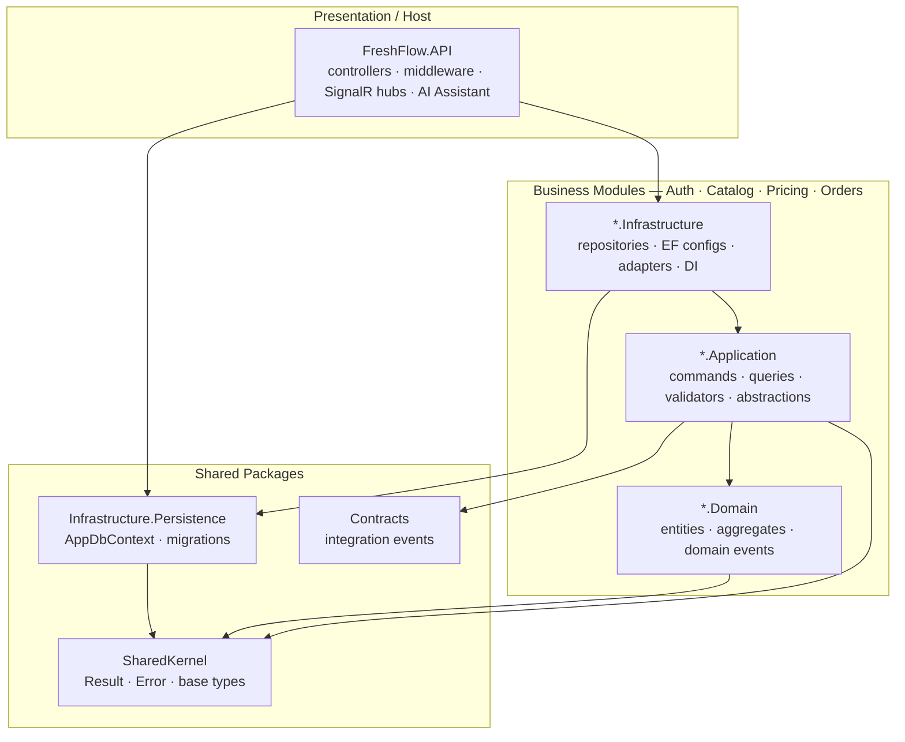
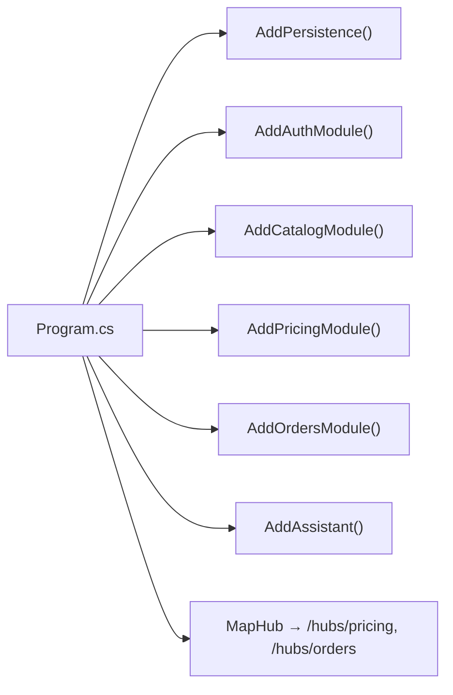
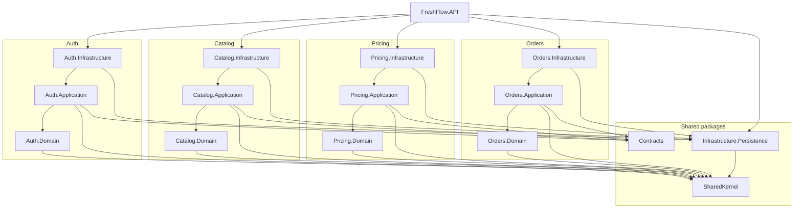

# FreshFlow — Package Diagram

| | |
|---|---|
| **Date** | 2026-07-01 |
| **Scope** | Package (project) structure and dependency direction of the implemented backend |
| **Source of truth** | `.csproj` references under `src/` + `Program.cs` module registration |
| **Renders to** | SDD §1.2 Package Diagram (export this mermaid to an image and insert) |

> This is the dedicated Package Diagram for the Software Design Document. It refines the two
> dependency mermaid diagrams in [`02A-system-overview-diagrams.md §3`](./02A-system-overview-diagrams.md#3-clean-architecture-and-project-dependency-view)
> into a single package view. There is **no draw.io page** for it yet — render this mermaid
> (e.g. mermaid.live / VS Code Mermaid preview) to produce the image.

---

## 1. Package Diagram (high-level)

The backend is organized into three package groups. Every business module follows the **same
Clean Architecture pattern** (`Domain` ← `Application` ← `Infrastructure`), so the pattern is shown
**once** here using wildcard names (`*.Domain`, `*.Application`, `*.Infrastructure`) that stand for
each concrete module. Arrows point **from a package to the package it depends on**; the direction is
enforced by `.csproj` references:

```
Domain          →  SharedKernel only
Application     →  Domain + SharedKernel + Contracts
Infrastructure  →  Application + Infrastructure.Persistence + EF Core / Redis
API (host)      →  every module's Infrastructure (DI registration only)
```



**How to read it:** the `Modules` box is a template — it represents each of the four implemented
modules (Auth, Catalog, Pricing, Orders), which all have the identical three-layer shape and the
same dependencies. The detailed, per-module expansion is in [§4](#4-detailed-per-module-expansion-optional).

**Note — AI Assistant:** the assistant is **not** a separate module. It lives in the host as
`src/FreshFlow.API/Assistant` and orchestrates existing module commands/queries via MediatR
`ISender`; it is therefore part of `FreshFlow.API`, not its own package.

**Note — planned modules:** `Logistics`, `Hub`, `Analytics`, `Notifications` exist as referenced
project stubs only (not registered in `Program.cs`) and are omitted from this view.

---

## 2. Runtime Registration (Program.cs wiring)

Complementary view — the order in which the host wires modules into the DI container:



---

## 3. Package Descriptions

| No | Package (project) | Layer | Description |
|---|---|---|---|
| 01 | `FreshFlow.SharedKernel` | Shared | `BaseEntity`, `AggregateRoot`, `ValueObject`, `Result<T>`, `Error`, `IDomainEvent`, `ICommand/IQuery`. |
| 02 | `FreshFlow.Contracts` | Shared | Cross-module integration-event records. References SharedKernel only. |
| 03 | `FreshFlow.Infrastructure.Persistence` | Shared | Shared `AppDbContext`, centralized EF migrations, model snapshot, domain-event dispatch interceptor. |
| 04 | `FreshFlow.API` | Host | Controllers, middleware, auth, rate limiting, SignalR hub mapping, AI Assistant orchestration. |
| 05 | `Auth.{Domain\|Application\|Infrastructure}` | Module | Identity, JWT, refresh-token rotation, RBAC, registration, password reset, email verification, restaurant/driver profiles, market assignments. |
| 06 | `Catalog.{Domain\|Application\|Infrastructure}` | Module | Markets, products, categories, units of measurement. |
| 07 | `Pricing.{Domain\|Application\|Infrastructure}` | Module | Market products, price snapshots, Redis cache writer, price-board SignalR broadcast. |
| 08 | `Orders.{Domain\|Application\|Infrastructure}` | Module | Draft & scheduled orders, order items, B2B credit, receipt confirmation, order issues, reorder. |
| 09 | `Logistics / Hub / Analytics / Notifications` | Module | `[PLANNED]` referenced stubs; not registered in `Program.cs`. |

---

## 4. Detailed Per-Module Expansion (optional)

The high-level diagram in §1 collapses the four modules into one template. If a fully expanded
view is needed, this diagram draws each module's three packages explicitly. Use §1 for the SDD and
this one only as a supporting appendix.


