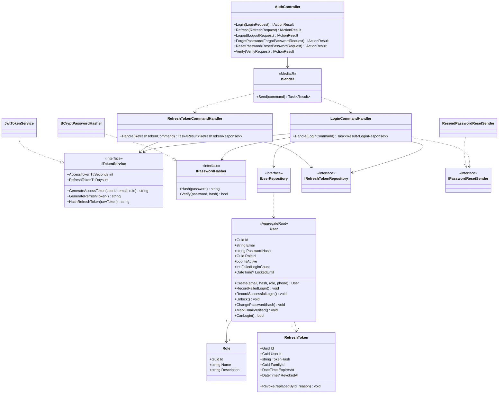
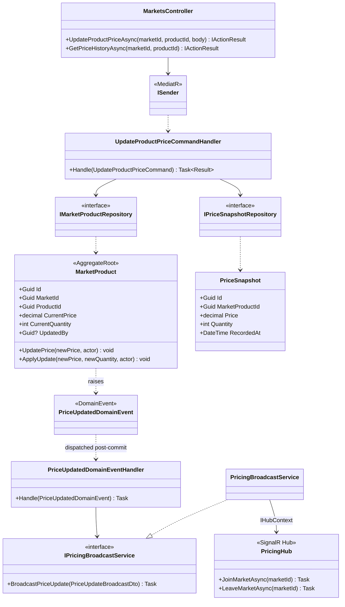
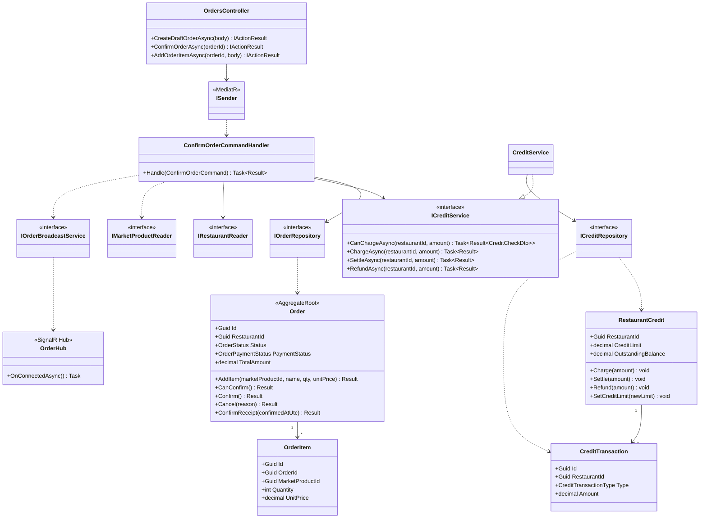
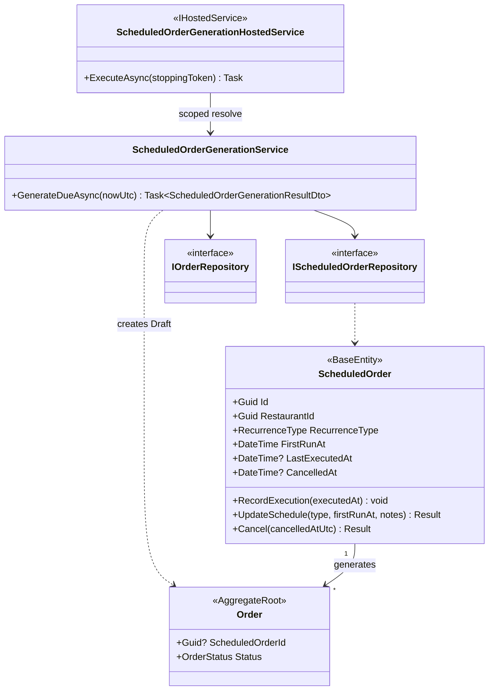
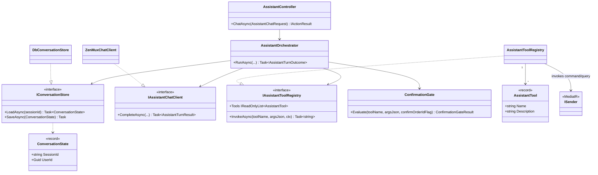

# 02E — Class Diagrams (Detailed Design)

> Companion to the SDD (Report 4) **§3 Detailed Design**. One `classDiagram` per implemented feature,
> derived from the actual source under `src/`. Signatures are trimmed for readability (async suffixes and
> `CancellationToken` parameters omitted); see the referenced source files for the full API.
>
> Shared request pipeline (not repeated per feature): `Controller -> MediatR ISender -> ValidationBehavior -> Command/Query Handler -> Repository -> EF Core -> post-commit domain events`. See [`02A-system-overview-diagrams.md §4`](./02A-system-overview-diagrams.md#4-http-request-pipeline).

---

## 1. Authentication & Authorization (§3.1)

Source: `src/Modules/Auth/**`, `src/FreshFlow.API/Controllers/AuthController.cs`

---

## 2. Real-time Pricing Update (§3.2)

Source: `src/Modules/Pricing/**`, `src/FreshFlow.API/Controllers/MarketsController.cs`

---

## 3. Order Creation & B2B Credit (§3.3)

Source: `src/Modules/Orders/**`, `src/FreshFlow.API/Controllers/OrdersController.cs`

---

## 4. Scheduled Order Generation (§3.4)

Source: `src/Modules/Orders/FreshFlow.Orders.Application/Services/ScheduledOrderGenerationService.cs`, `ScheduledOrderGenerationHostedService`

---

## 5. AI Shopping Assistant (§3.5)

Source: `src/FreshFlow.API/Assistant/**`, `src/FreshFlow.API/Controllers/AssistantController.cs`

---

### Rendering

These are GitHub-flavoured mermaid `classDiagram` blocks. To export images for the SDD:
`mmdc -i docs/diagrams/02E-class-diagrams.md -o out.png` (mermaid-cli), or paste a single block into <https://mermaid.live>.
