# FreshFlow — Luồng thao tác theo Role

| | |
|---|---|
| Cập nhật | 2026-07-29 |
| Nguồn sự thật | Controller, command/query handler và domain hiện tại |
| Role | `admin`, `operations_manager`, `restaurant`, `market_agent`, `hub_staff`, `driver` |
| Luồng giao hàng | **Hub → Restaurant** |

> Sơ đồ này mô tả hành vi đang có trong code, kể cả các giới hạn hiện tại. Các tài liệu kế hoạch cũ
> không được xem là chức năng đã triển khai.

## 1. Bản đồ trách nhiệm

| Role | Phạm vi dữ liệu | Trách nhiệm chính |
|---|---|---|
| Admin | Toàn hệ thống | Người dùng, nhà hàng, catalog, cấu hình, procurement, công nợ, Hub và logistics |
| Operations Manager | Toàn hệ thống trong các API được mở | Điều phối Hub, route, xe, đơn, analytics; không quản trị user/catalog/procurement admin |
| Restaurant | Chỉ hồ sơ và dữ liệu nhà hàng của mình | Đặt hàng, theo dõi đơn, xác nhận nhận hàng, sự cố, công nợ, hóa đơn |
| Market Agent | Chỉ Market và batch được phân công | Giá/tồn khả dụng, thu mua, báo ngoại lệ, bàn giao về Hub |
| Hub Staff | Chỉ Hub được phân công | Nhận hàng, đối soát, sorting, outbound, xem và dispatch route của Hub |
| Driver | Chỉ route/delivery được gán cho mình | Nhận bàn giao, pickup, chạy route, giao hàng, POD và sự cố |

Mọi role đã đăng nhập đều có thể dùng hồ sơ cá nhân, thông báo và một số catalog đọc công khai nội bộ.
Quyền nghiệp vụ vẫn được kiểm tra thêm theo ownership, Market assignment, Hub assignment hoặc Driver assignment.

## 2. Luồng end-to-end

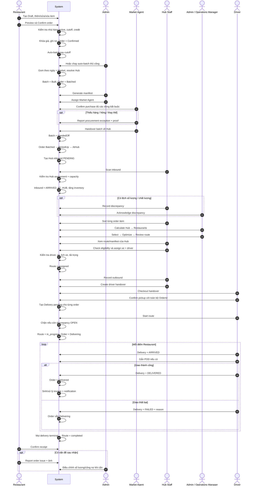

## 3. State machine chính

### 3.1 Order

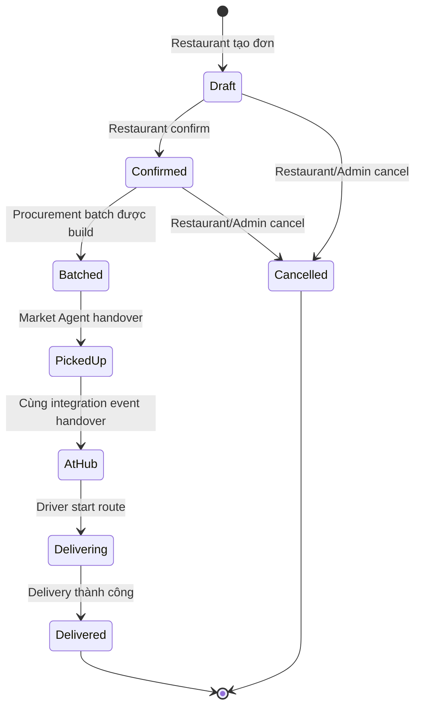

Order đã `Batched` không được hủy riêng. Admin chỉ có thể hủy cả batch trước khi Agent mua hàng.

### 3.2 Procurement batch

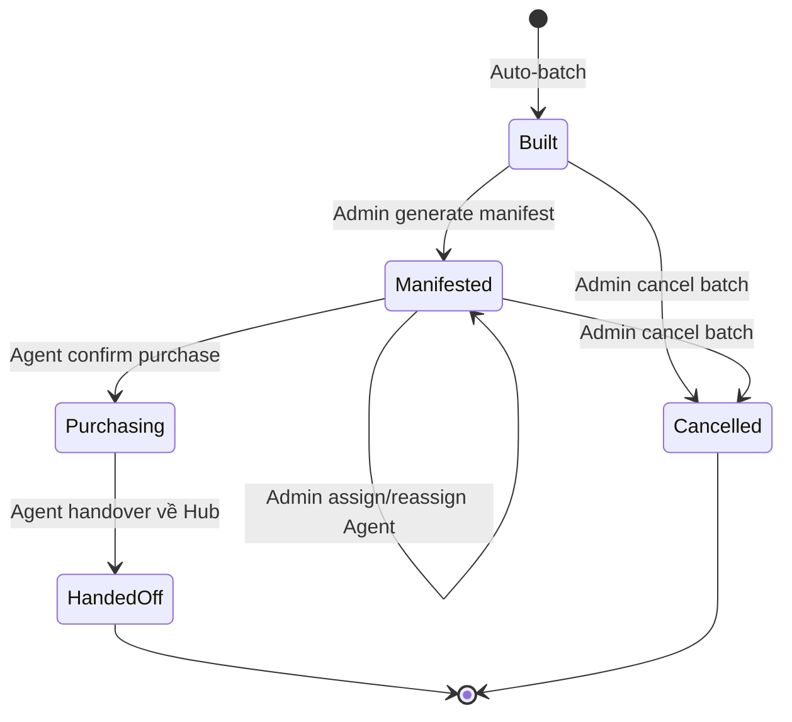

`Confirm purchase` phải chứa đúng một dòng cho mỗi batch item không được miễn bởi exception
`Unavailable`; actual quantity và actual unit price phải lớn hơn 0.

### 3.3 Route

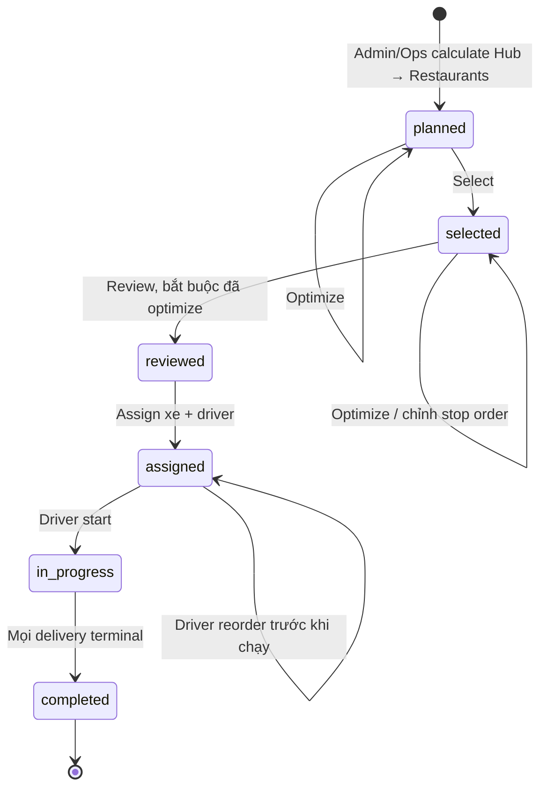

Route luôn có đúng một Hub stop khớp `HubId`, ít nhất một Restaurant stop và tối đa 20 stop.

### 3.4 Delivery

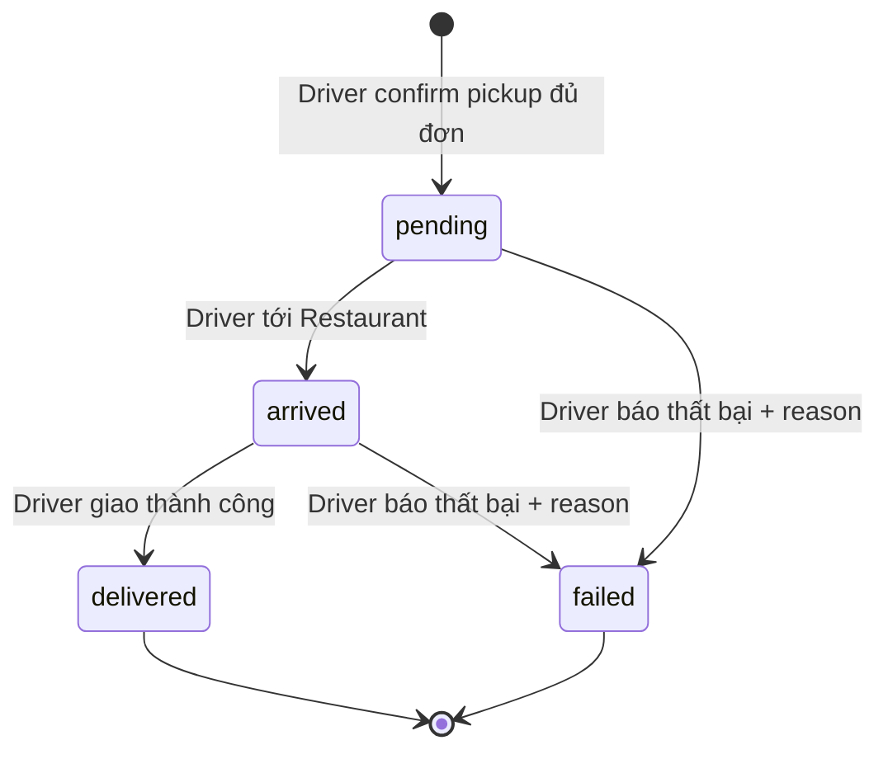

## 4. Luồng từng Role

### 4.1 Admin

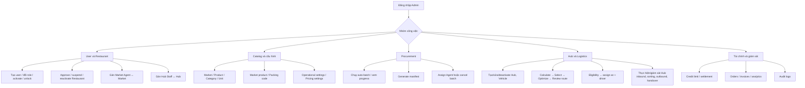

Điểm riêng của Admin:

- Chỉ Admin quản lý user, role, duyệt nhà hàng, catalog ghi, packing code, operational/pricing settings.
- Chỉ Admin điều khiển procurement batch: auto-batch, manifest, assign Agent, cancel batch.
- Admin được bypass Hub assignment khi thao tác Hub/route.

### 4.2 Operations Manager

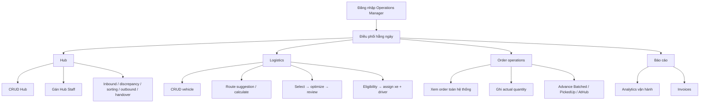

Operations Manager **không** có quyền Admin-only: quản lý user/role, duyệt Restaurant, catalog ghi,
packing code, credit settlement/limit, operational settings và điều khiển procurement batch.

### 4.3 Restaurant

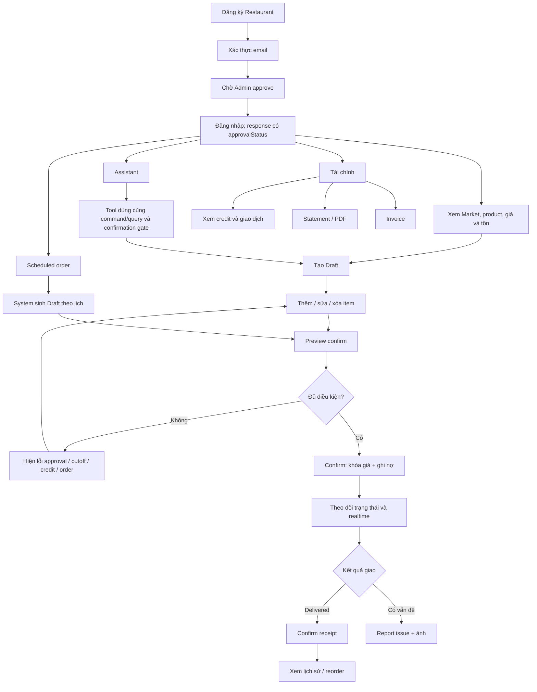

Các cổng chặn khi confirm:

- Order phải thuộc Restaurant đang đăng nhập, còn `Draft` và có item.
- Restaurant phải ở trạng thái `Active`; tài khoản pending/suspended vẫn có thể login nhưng không confirm.
- Không vượt hạn mức công nợ; giá được khóa khi confirm.
- Sau cutoff, ngày giao có thể được đẩy sang chu kỳ kế tiếp theo operational settings.

Restaurant chỉ xem/sửa dữ liệu của mình; các endpoint dùng `restaurantId` vẫn kiểm tra ownership.

### 4.4 Market Agent

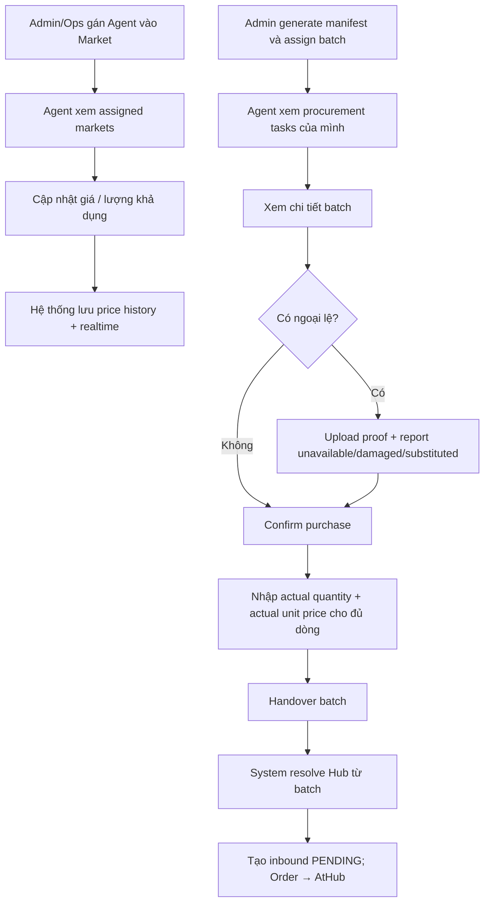

Các giới hạn:

- Chỉ cập nhật giá/tồn tại Market được gán.
- Chỉ thấy và thao tác procurement batch được gán cho chính Agent.
- Không truyền `HubId` khi handover; batch đã giữ Hub được resolve từ Market lúc batching.
- Không thể handover trước khi batch ở `Purchasing`.

### 4.5 Hub Staff

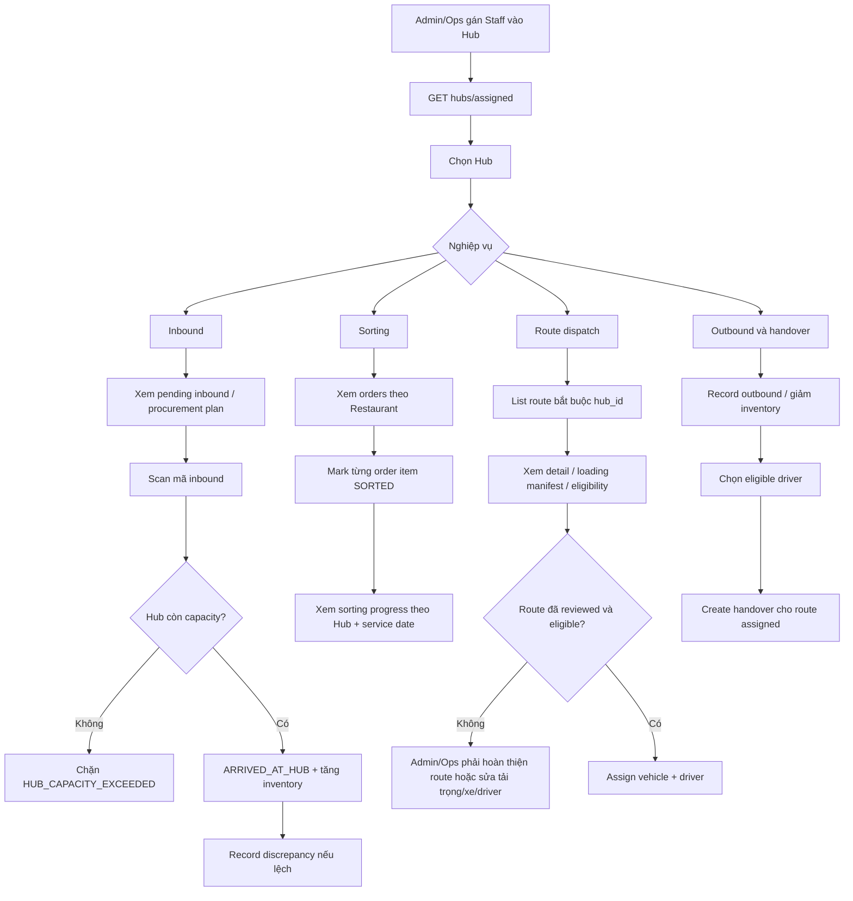

Hub Staff:

- Chỉ truy cập Hub có assignment active; Admin/Ops bypass giới hạn này.
- Xem được route của Hub khi truyền `hub_id`, nhưng không được calculate/select/optimize/review.
- Được assign xe + driver cho route của Hub sau khi Admin/Ops đã review.
- Không được acknowledge discrepancy; thao tác này chỉ dành cho Admin/Ops.

Điều kiện assign route:

1. Route phải `reviewed`.
2. Driver bắt buộc, tồn tại, active và có role `driver`.
3. Vehicle tồn tại, active, available và không bị gán route khác cùng service date.
4. Số stop không vượt cấu hình.
5. Nếu có order `AtHub`, mọi order phải có packing lines và mọi line phải có `CapacityKg > 0`.
6. Tổng `quantity × capacityKg` không vượt tải trọng xe.

### 4.6 Driver

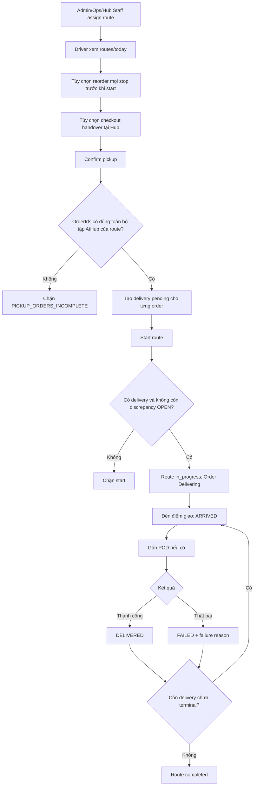

Các cổng bảo mật:

- Driver chỉ xem/chạy route được gán cho user ID trong JWT.
- Confirm pickup phải gửi **đúng và đủ**, không thừa/thiếu, toàn bộ order `AtHub` thuộc các Restaurant
  stop, đúng Hub và service date của route.
- Chỉ route `assigned` mới pickup/reorder/start; chỉ route `in_progress` mới cập nhật delivery.
- Delivery chỉ đi `pending → arrived → delivered` hoặc từ `pending/arrived → failed`.

## 5. Ma trận API theo Role

| Nhóm thao tác | Admin | Ops | Restaurant | Market Agent | Hub Staff | Driver |
|---|:---:|:---:|:---:|:---:|:---:|:---:|
| Auth/profile/notification cá nhân | ✓ | ✓ | ✓ | ✓ | ✓ | ✓ |
| Quản lý user/role/Restaurant approval | ✓ | — | — | — | — | — |
| Catalog ghi | ✓ | — | — | — | — | — |
| Catalog/Market đọc | ✓ | ✓ | ✓ | ✓ | ✓ | Một phần |
| Cập nhật giá/tồn Market | — | — | — | Market được gán | — | — |
| Order đặt hàng | — | — | Own | — | — | — |
| Order đọc/điều phối | ✓ | ✓ | Own | — | Theo Hub read model | Qua delivery |
| Procurement batch admin | ✓ | — | — | Task được gán | Chỉ plan/inbound | — |
| Hub CRUD/staff assignment | ✓ | ✓ | — | — | Self-list | — |
| Hub operations | ✓ | ✓ | — | Handover vào Hub | Hub được gán | Checkout riêng |
| Route plan/review | ✓ | ✓ | — | — | — | — |
| Route read/eligibility/assign | ✓ | ✓ | — | — | Hub được gán | Route được gán |
| Delivery execution | — | — | Theo dõi/receipt | — | Dispatch | Route được gán |
| Credit settlement/limit | ✓ | — | Chỉ xem | — | — | — |
| Invoice | Toàn hệ thống | Toàn hệ thống | Own | — | — | — |
| Analytics | Toàn bộ | Toàn bộ | Price trends | — | Hub throughput | — |

### API trọng tâm

| Role | API chính |
|---|---|
| Admin | `/api/v1/admin/*`, catalog write, `/hubs`, `/logistics/*`, Hub operations, `/analytics`, `/invoices` |
| Operations Manager | `/hubs`, Hub staff assignments/operations, `/logistics/*`, order ops, `/analytics`, `/invoices` |
| Restaurant | `/auth/register`, `/restaurants/me/*`, `/orders`, `/assistant/chat`, favorites, credit, invoices |
| Market Agent | `/pricing/assigned-markets`, Market price/quantity, `/procurement/tasks/*` |
| Hub Staff | `/hubs/assigned`, inbound/sorting/outbound/handover, scoped `/logistics/routes`, vehicle read |
| Driver | `/driver/*`, `/hubs/{hubId}/handover/{id}/checkout` |

## 6. Menu UI gợi ý

| Role | Menu tối thiểu |
|---|---|
| Admin | Dashboard · Users · Restaurants · Catalog · Markets · Procurement · Hubs · Routes · Fleet · Credit · Invoices · Analytics · Audit |
| Operations Manager | Dashboard · Orders · Hubs · Hub Staff · Routes · Fleet · Deliveries · Invoices · Analytics |
| Restaurant | Market · Cart · Orders · Scheduled Orders · Favorites · Assistant · Credit · Invoices · Profile |
| Market Agent | Assigned Markets · Price & Stock · Procurement Tasks · Exceptions |
| Hub Staff | My Hubs · Pending Inbound · Procurement Plan · Sorting · Routes · Loading Manifest · Outbound · Handovers |
| Driver | Today Routes · Pickup · Current Delivery · Proof/Issues · History |

## 7. Điểm cần biết trong logic hiện tại

1. Order chuyển `Batched → PickedUp → AtHub` ngay khi Market Agent handover; Hub scan xảy ra sau đó.
2. Driver checkout handover và start route là hai luồng chưa ràng buộc: start chưa kiểm tra handover đã
   `CHECKED_OUT`.
3. POD chưa bắt buộc trước khi chuyển delivery sang `DELIVERED`.
4. Delivery `FAILED` làm Order giữ ở `Delivering`; route vẫn `completed` khi mọi delivery đã
   `delivered/failed`, nên cần Ops follow-up cho đơn thất bại.
5. Eligibility chặn vehicle double-book theo ngày nhưng chưa chặn driver bị gán nhiều route cùng ngày.
6. Khi route chưa có order `AtHub`, kiểm tra weight hiện xem là đầy đủ; pickup tạo 0 delivery và start
   sẽ bị chặn bởi `ROUTE_HAS_NO_DELIVERIES`.
7. `RouteStatus.cancelled` tồn tại nhưng chưa có API chuyển route sang trạng thái này.
8. Procurement admin endpoints hiện là Admin-only, Operations Manager không được manifest/assign Agent/cancel batch.
