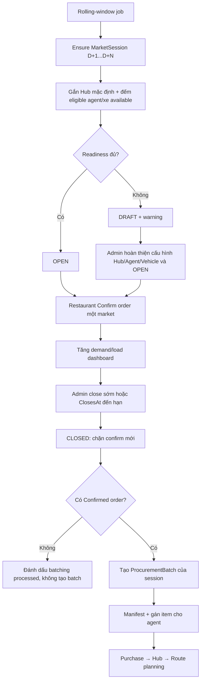

# PLAN — Phiên chợ độc lập theo market, tự sinh rolling 7 ngày

- **Ngày:** 2026-08-13
- **Module sở hữu:** Procurement
- **Module tích hợp:** Orders, Logistics, Auth, Hub
- **Trạng thái:** Draft, chờ Jira key
- **Mục tiêu:** mỗi market có lịch nhận đơn độc lập; hệ thống tự chuẩn bị các phiên sắp tới,
  admin theo dõi nguồn lực/đóng phiên, và `ProcurementBatch` chỉ sinh từ phần order đã chốt.

## 1. Quyết định đã chốt

1. Không tạo `OrderingSession` toàn hệ thống. Đơn vị vận hành là
   `MarketSession(MarketId, ServiceDate)`.
2. Rolling window dùng `OperationalSettings.DeliveryWindowDays`, hiện mặc định **7 ngày**;
   job bảo đảm luôn có phiên từ **D+1 đến D+7** theo `Asia/Ho_Chi_Minh`.
3. Phiên mới chỉ gắn `HubId` mặc định (active hub của market). Không snapshot agent/vehicle vào
   phiên — nguồn lực lấy live từ eligibility/fleet sẵn có tại thời điểm kiểm tra hoặc thực thi.
4. Phiên tự sinh là `OPEN` nếu đủ readiness tối thiểu: batching đang bật, có hub, có ít nhất một
   eligible market agent và hub có ít nhất một xe active/available cho ngày đó. Thiếu điều kiện thì
   sinh `DRAFT` để admin hoàn thiện cấu hình nguồn lực rồi mở; không cần allocation theo phiên.
5. Job **chỉ insert phiên còn thiếu**, không cập nhật phiên đã tồn tại và không ghi đè chỉnh sửa
   của admin.
6. Một `Order` chỉ được chứa sản phẩm của **một market**. Đây là điều kiện cần để từng market
   đóng độc lập mà không phải thêm sub-order/shipment lifecycle.
7. `MarketSession` là cửa nhận đơn; `ProcurementBatch` là chứng từ thực thi mua hàng sau khi cửa
   đã đóng. Không sinh batch rỗng trước.
8. Một session có tối đa một active batch; batch cũ bị cancel/reset có thể được tạo lại.
9. Đóng phiên không hủy order đã `Confirmed`; chỉ chặn confirm mới.
10. MVP không tự đóng theo phần trăm tải. Dashboard cảnh báo, admin hoặc thời điểm `ClosesAt`
    quyết định đóng.

## 2. Hiện trạng và khoảng trống

### Orders

- `OrderCutoffScheduler` chỉ dời ngày giao sang D+1/D+2; chưa biết ngày/market có đang nhận đơn.
- `OrderConfirmationService` là seam chung của confirm thủ công và scheduled-order auto-confirm,
  nên guard phiên phải đặt tại đây.
- `Order` chưa có `MarketId`; `MarketProductSnapshotDto` cũng chưa trả `MarketId` dù projection
  đã đọc từ `market_products`.
- Các đường tạo item cần cùng tuân thủ single-market:
  - `CreateDraftOrderCommandHandler`;
  - `AddOrderItemCommandHandler`;
  - `ReorderFromHistoryCommandHandler`;
  - `ScheduledOrderGenerationService`;
  - create/update scheduled-order template.

### Procurement

- `BatchConfirmedOrdersService` đã group line theo `MarketId` và `BatchDate`, tức batch thực tế đã
  mang đúng granularity market/ngày.
- `ProcurementBatchingHostedService` hiện xử lý một cycle toàn ngày, chưa có lifecycle từng market.
- `ProcurementBatch.MergeIn` còn nhận order muộn khi batch `Built/Manifested`; sau khi có hard-close
  thì normal flow không còn cần merge muộn.
- `procurement_batch_orders.order_id` đang unique cho active row, nên một order không thể thuộc
  nhiều batch.
- Event `ProcurementBatchBuiltIntegrationEvent` chuyển **toàn bộ Order** sang `Batched` ngay khi
  một batch chứa order đó được tạo.

Hai constraint cuối khiến order nhiều market không tương thích với batch hiện tại. Enforce một
order/một market là thay đổi nhỏ nhất và giữ nguyên lifecycle `Confirmed → Batched`.

### Agent, Hub và Vehicle

- Agent eligibility đã có: active user, role `market_agent`, có `user_market_assignments` tới market;
  mở rộng reader hiện có bằng query count cho readiness; batch assignment tiếp tục dùng query kiểm
  tra từng agent, không cần pool riêng của session.
- Mỗi market có tối đa một active hub (`ux_hubs_active_market`).
- Vehicle đã có `HubId`, `CapacityKg`, `IsAvailable`; repository đã hỗ trợ lọc theo hub và route
  reservation đã chống double-book theo ngày. `RoutePlanningInputBuilder` hiện truyền `hubId = null`,
  nên phải sửa lời gọi để chỉ lấy fleet của hub đang lập route. Session không sở hữu/allocate xe
  (xem §16).

## 3. Luồng đích



## 4. Mô hình dữ liệu

### 4.1 `MarketSession` — Procurement aggregate

```text
MarketSession
- Id                    uuid
- MarketId              uuid
- HubId                 uuid?       // null khi market chưa có active hub
- ServiceDate           date
- Status                Draft | Open | Closed
- ClosesAt              timestamptz  // mặc định D-1 + DailyCutoffTime, giờ Việt Nam
- CreatedSource         Auto | Manual
- ClosedAt              timestamptz?
- ClosedBy              uuid?
- CloseReason           varchar(500)?
- BatchingCompletedAt   timestamptz? // set cả khi session không có order
- CreatedAt
- UpdatedAt                         // concurrency token
- DeletedAt
```

Ràng buộc:

```text
UNIQUE (market_id, service_date) WHERE deleted_at IS NULL
INDEX  (status, closes_at)       WHERE deleted_at IS NULL
```

Domain methods tối thiểu:

```text
Create(...defaults...)     -> Draft hoặc Open theo readiness
UpdateSchedule(closesAt)
Open(hubId)                -> bind/refresh HubId sau khi caller kiểm tra readiness
Close(actorId, reason, at) -> idempotent nếu đã Closed
MarkBatchingCompleted(at)
```

`OpenMarketSessionCommandHandler` re-resolve active hub, kiểm tra readiness live rồi gọi
`Open(hubId)` để cập nhật `HubId` khi session còn `Draft`. Sau khi session đã `Open`, `HubId` được
giữ ổn định cho order/batch của phiên đó. Domain method còn yêu cầu `ClosesAt > now`; không mở lại
phiên đã quá cutoff.

Không thêm state `Processing`/`Completed`; tiến độ thực thi lấy từ linked `ProcurementBatch`, tránh
hai state machine cùng mô tả một việc.

### 4.2 Liên kết `ProcurementBatch`

Thêm:

```text
ProcurementBatch.MarketSessionId uuid?
```

Nullable để rollout/backfill lịch sử, nhưng mọi batch mới bắt buộc có session. Partial unique index:

```text
UNIQUE (market_session_id)
WHERE market_session_id IS NOT NULL
  AND status <> 'Cancelled'
  AND deleted_at IS NULL
```

`ResetBatchingDay` soft-delete batch/link cũ và reset `MarketSession.BatchingCompletedAt = NULL` cho
các session liên quan; session vẫn `Closed`, nên retry không mở cửa nhận đơn.

### 4.3 Single-market Order

Thêm nullable-rollout:

```text
Order.MarketId           uuid?
ScheduledOrder.MarketId  uuid?
MarketProductSnapshotDto.MarketId
```

Quy tắc aggregate:

- item đầu tiên gán `Order.MarketId`;
- item tiếp theo khác market trả `ORDER_MARKET_MISMATCH`;
- xóa item cuối cùng reset `MarketId = null`, cho phép tái sử dụng empty Draft;
- `Confirm` yêu cầu `MarketId != null`;
- create/update scheduled-order resolve market của tất cả template items và áp cùng invariant;
- legacy scheduled order không có item giữ `MarketId = null` và tiếp tục degrade thành Draft.

Giữ `procurement_batch_orders.order_id` unique hiện tại vì sau thay đổi mỗi order chỉ đi vào đúng
một market batch.

## 5. Rolling-window generation

Tái sử dụng `ProcurementBatchingHostedService`; không tạo hosted service thứ hai.

Mỗi tick:

1. Tính `today` theo `Asia/Ho_Chi_Minh` bằng `TimeProvider`.
2. Đọc `DeliveryWindowDays` từ operational settings (mặc định 7).
3. Lấy active markets.
4. Đọc session đã có trong `[D+1, D+N]`.
5. Với từng `(market, date)` còn thiếu:
   - tìm active hub;
   - đếm eligible agents của market (readiness, không lưu allocation);
   - đếm xe active/available của hub chưa bị reservation trong ngày (readiness, không reserve xe);
   - tính `ClosesAt = serviceDate - 1 ngày + DailyCutoffTime` tại giờ Việt Nam;
   - tạo session trong một transaction;
   - status `Open` nếu batching đang bật, có hub, ≥1 eligible agent và ≥1 xe available; ngược lại
     `Draft`.
6. Bắt unique violation như idempotent success để nhiều app instance không tạo trùng.
7. Không sửa bất kỳ session đã tồn tại.
8. Close các session `Draft` hoặc `Open` có `ClosesAt <= now`; Draft quá hạn không được nằm lại để admin vô tình mở muộn.
9. Xử lý batch cho các session `Closed && BatchingCompletedAt == null`.

`OperationalSettings.BatchingEnabled` tham gia readiness và gate bước tạo batch. Khi setting được bật
lại, session `Draft` đã tồn tại cần admin chủ động `Open`; job không tự sửa session cũ. Session
`Closed` chưa batch giữ `BatchingCompletedAt = null` để retry. Kill switch hạ tầng
`Procurement:Batching:Enabled=false` vẫn dừng toàn bộ background worker như hiện tại; admin API vẫn
có thể quản lý session thủ công.

## 6. Guard xác nhận order và xử lý race

### 6.1 Điểm đặt guard

Đặt trong `OrderConfirmationService.ConfirmAsync`, sau khi `OrderConfirmationEvaluator` đã resolve
`ScheduledFor`, trước các mutation:

```text
ApplyConfirmationPricing
TryReserveStock
CaptureDeliveryAddress
Order.Confirm
ChargeAsync
```

Manual confirm và scheduled-order auto-confirm đều đi qua service này nên không thêm guard ở từng
controller/handler.

Map order vào session theo **ngày Việt Nam** của thời điểm đã resolve, không lấy UTC date trực tiếp:

```text
serviceDate = DateOnly(
    ConvertUtcToVietnam(evaluation.ResolvedScheduledFor))
```

Bổ sung một helper dùng chung trong `OrderCutoffScheduler` cho phép chuyển UTC `ScheduledFor` thành
`ServiceDate`; confirm guard, preview và backfill phải gọi cùng helper để không lệch ngày ở khoảng
00:00–06:59 giờ Việt Nam.

Preview confirmation gọi cùng reader ở chế độ read-only và trả issue tương ứng để FE báo trước.

### 6.2 Race close-vs-confirm

Chỉ kiểm tra status thông thường là không đủ: confirm và close có thể cùng đọc `Open` rồi cùng commit.
PostgreSQL locking bắt buộc:

- confirm transaction: lock row `(market_id, service_date)` bằng `FOR SHARE`, kiểm tra `Open`;
- close transaction: lock cùng row bằng `FOR UPDATE`, đổi sang `Closed`;
- lock được giữ tới hết transaction confirm hiện có.

Kết quả:

- confirm lấy lock trước được hoàn tất;
- close chờ confirm đó commit rồi đóng;
- sau khi close API trả thành công, không confirm mới nào lọt vào.

Error contract:

```text
MARKET_SESSION_NOT_AVAILABLE  422  chưa có session cho market/ngày
MARKET_SESSION_NOT_OPEN       409  session Draft/Closed
ORDER_MARKET_MISMATCH         422  cart chứa sản phẩm khác market
MARKET_SESSION_CONFLICT       409  concurrent admin update
```

Rollout phải generate/backfill session trước khi bật hard guard để tránh khóa toàn bộ checkout.

## 7. Sinh `ProcurementBatch` theo session

Refactor `IProcurementBatchingService` từ cycle-global sang operation chính:

```text
BuildSessionBatchAsync(marketSessionId, dryRun, ct)
```

Flow:

1. Load + lock session.
2. Chỉ nhận `Closed` và `BatchingCompletedAt == null`.
3. Đọc order `Confirmed` theo đúng `Order.MarketId`, `ServiceDate`, chưa có active batch link.
4. Không có order: set `BatchingCompletedAt`, không tạo batch.
5. Có order: aggregate product lines, dùng `MarketId`/`HubId` từ session, tạo một batch.
6. Lưu batch + link + `BatchingCompletedAt` cùng transaction.
7. Unique indexes xử lý retry/race.
8. Event hiện tại chuyển order `Confirmed → Batched`; single-market invariant bảo đảm không chuyển
   sớm khi còn một market khác chưa batch.

Manual endpoint cũ giữ backward compatibility:

```http
POST /api/v1/admin/order-groups/auto-batch
```

- `TargetDate` khiến handler iterate các **Closed** session của ngày đó.
- `DryRun=true` preview từng session.
- `Force` không được bypass session `Open`; nếu cần đóng sớm, admin phải gọi close rõ ràng.
- bỏ normal-flow merge order mới vào batch `Built/Manifested`; closed session không thể có order mới.

Manual close ưu tiên an toàn:

1. commit `Closed` trước;
2. thử build batch ngay;
3. nếu build thất bại, API vẫn trả session đã đóng cùng `batchingStatus = pending`; hosted job retry.

Không rollback close chỉ vì batch tạm thời lỗi, vì rollback sẽ mở lại cửa nhận order.

## 8. Nguồn lực khi thực thi (không thêm allocation)

Session không chèn thêm tầng allocation nào (xem §16). Agent assignment giữ nguyên; route planning
chỉ sửa scope fleet về đúng hub của route.

### Agent → ProcurementBatch

- `AssignBatchItemsCommandHandler` giữ nguyên: agent phải active, role `market_agent`, đúng market
  qua reader eligibility sẵn có. Không kiểm tra pool membership của session.
- Multi-agent item assignment hiện có giữ nguyên; không tự chia sản phẩm cho agent.

### Vehicle → Route planning

- Sửa đúng một điểm trong `RoutePlanningInputBuilder`: truyền `hubId` vào
  `vehicles.GetPageAsync(...)` thay vì `null`, để chỉ lấy xe active của hub đang lập route.
- Sau đó giữ nguyên lọc `IsAvailable`, reservation theo ngày, capacity policy, `InputRevision` và DB
  double-book guard.

## 9. API đề xuất

### Admin

```http
GET  /api/v1/admin/market-sessions?from=&to=&market_id=&status=
GET  /api/v1/admin/market-sessions/{id}
PUT  /api/v1/admin/market-sessions/{id}
POST /api/v1/admin/market-sessions/{id}/open
POST /api/v1/admin/market-sessions/{id}/close
```

`PUT` chỉ chỉnh `closesAt`. MVP không có allocation agent/vehicle theo phiên để sửa.

Close request:

```json
{
  "reason": "Đã đạt ngưỡng tải vận chuyển dự kiến"
}
```

### Restaurant/read-only

```http
GET /api/v1/market-sessions?from=&to=&market_id=
```

Chỉ trả dữ liệu cần chọn ngày: market, service date, status, closesAt; không lộ agent/vehicle nội bộ.
Server-side confirm guard vẫn là nguồn chân lý, không phụ thuộc FE disable nút.

## 10. Dashboard DTO

Mỗi session trả:

```text
Market / Hub / ServiceDate / Status / ClosesAt
ConfirmedOrderCount
RestaurantCount
EstimatedLoadKg
HubVehicleCapacityKg          // tổng effective capacity của xe active/available, đúng hub/ngày
LoadUtilizationPercent
EligibleAgentCount            // đếm từ eligibility reader
Readiness: Ready | Warning | Blocked
Warnings[]
ProcurementBatchId / ProcurementBatchStatus
RoutePlanId / RoutePlanStatus
```

Warnings tối thiểu:

```text
HUB_NOT_CONFIGURED
NO_MARKET_AGENT
NO_VEHICLE            // hub không có xe active/available cho ngày đó
BATCHING_DISABLED
MISSING_PACKING_WEIGHT
LOAD_CAPACITY_WARNING
STOP_CAPACITY_WARNING
OVERSIZED_RESTAURANT
```

`EstimatedLoadKg` tái sử dụng packing formula và `CapacityUtilizationPercent` của Logistics; không
tạo công thức tải thứ hai trong controller.

## 11. Migration và rollout an toàn

### Gate 0 — audit dữ liệu trước khi code guard

Chạy read-only query để tìm:

1. order hiện tại chứa sản phẩm từ hơn một market;
2. scheduled-order template chứa sản phẩm từ hơn một market;
3. market active không có active hub;
4. vehicle chưa có `HubId`;
5. future confirmed orders cần session backfill;
6. procurement batch lịch sử không map duy nhất theo `(MarketId, BatchDate)`.

Nếu có order nhiều market, dừng rollout và chọn một trong hai cách nghiệp vụ: hủy/tách thủ công hoặc
xây `MarketShipment`. Migration không tự đoán cách chia phí, credit hay trạng thái.

### Migration A — additive

1. Tạo `market_sessions` + indexes.
2. Thêm nullable `orders.market_id`, `scheduled_orders.market_id`.
3. Thêm nullable `procurement_batches.market_session_id`.
4. Backfill `Order.MarketId`/`ScheduledOrder.MarketId` khi toàn bộ item cùng một market.
5. Tạo/backfill session cho future orders và existing batch dates.
6. Backfill `ProcurementBatch.MarketSessionId` theo `(MarketId, BatchDate)`.
7. Không apply migration tự động vào DB production.

### Deploy A — compatibility

- deploy entity/repository/generator/admin API;
- enforce single-market cho order mới;
- chạy generator và kiểm tra dashboard;
- chưa bật hard confirm guard.

### Deploy B — enforcement

- bật row-lock guard ở confirm/preview;
- chuyển batching sang session-scoped;
- theo dõi blocked-confirm và pending-batch metrics.

Giữ `Order.MarketId` nullable vì empty Draft/legacy schedule hợp lệ; domain/handler mới là nơi yêu cầu
MarketId trước confirm.

## 12. Thứ tự implement

1. **Data audit + chốt single-market migration.** Không qua gate này thì không code enforcement.
2. **Procurement Domain/Persistence:** `MarketSession`, repository, migration.
3. **Generator:** mở rộng operational-settings reader + `ProcurementBatchingHostedService`.
4. **Admin/read APIs:** list/detail/update/open/close + audit log.
5. **Orders single-market:** snapshot `MarketId`, aggregate invariant, scheduled-order validation,
   nullable backfill.
6. **Confirm gate:** preview + shared confirmation service + PostgreSQL row locks.
7. **Session batching:** `MarketSessionId`, per-session reader/service, reset/recovery.
8. **Dashboard summary + observability.**

Mỗi bước có migration/code/test riêng; không gộp toàn bộ thành một PR lớn.

## 13. Test bắt buộc

### Unit

- lifecycle `Draft → Open → Closed`, close idempotent, không reopen hoặc open sau cutoff;
- `Open` refresh active hub và từ chối khi thiếu agent/xe của đúng hub/ngày;
- generator D+1..D+N đúng timezone, không overwrite session cũ;
- UTC `ScheduledFor` quanh nửa đêm Việt Nam map đúng `ServiceDate`;
- Draft quá cutoff tự đóng; batching disabled giữ batch pending để retry;
- readiness đủ/thiếu hub-agent-vehicle;
- single-market ở create/add/remove/reorder/scheduled template;
- confirm missing/Draft/Closed session trả đúng error;
- đóng Market A không ảnh hưởng Market B cùng ngày;
- closed session rỗng đánh dấu batching completed nhưng không tạo batch;
- closed session có order tạo đúng một batch; retry không trùng;
- reset batch giữ session Closed và cho build lại.

### PostgreSQL integration

- unique `(market_id, service_date)` dưới hai generator đồng thời;
- race confirm-vs-close chứng minh không có confirm commit sau close;
- partial unique một active batch/session;
- cross-module `ToSqlQuery` cho market, agent (readiness), hub, vehicle (readiness/dashboard);
- `RoutePlanningInputBuilder` loại xe của hub khác và xe đã reserved trong ngày;
- event batch chuyển đúng order sang `Batched`;
- scheduled-order auto-confirm bị chặn bởi closed session và degrade thành Draft + notification.

### Regression gates

```bash
dotnet build FreshFlow.slnx
dotnet test tests/Unit/FreshFlow.Orders.UnitTests/
dotnet test tests/Unit/FreshFlow.Procurement.UnitTests/
dotnet test tests/Unit/FreshFlow.Logistics.UnitTests/
dotnet test tests/Integration/FreshFlow.IntegrationTests/
dotnet format FreshFlow.slnx --verify-no-changes
dotnet ef migrations has-pending-model-changes \
  --project src/FreshFlow.Infrastructure.Persistence \
  --startup-project src/FreshFlow.API
```

## 14. Observability và audit

Log structured events:

```text
MarketSessionGenerated
MarketSessionOpened
MarketSessionClosed
MarketSessionScheduleUpdated
MarketSessionConfirmRejected
MarketSessionBatchCreated
MarketSessionBatchRetryFailed
```

Admin update/open/close ghi audit log gồm actor, before/after `closesAt`, close reason và timestamps.
Không log nội dung order hoặc dữ liệu nhạy cảm.

## 15. Acceptance criteria

1. Mỗi active market luôn có session cho rolling delivery window mặc định 7 ngày.
2. Job restart/retry/multi-instance không tạo trùng và không ghi đè thay đổi admin.
3. Session chỉ tự `Open` khi có batching, active hub, eligible agent và xe available của đúng hub/ngày.
4. Admin đóng Market A/ngày D mà Market B/ngày D vẫn nhận order bình thường.
5. Sau khi close trả thành công, không order mới nào confirm vào Market A/ngày D.
6. Mọi manual/scheduled/assistant confirm đều dùng cùng guard và map `ServiceDate` theo giờ Việt Nam.
7. Một order không thể chứa sản phẩm từ hai market.
8. Closed session có order tạo đúng một active `ProcurementBatch`; session rỗng không tạo batch.
9. Batch item chỉ gán cho agent hợp lệ (active, role `market_agent`, đúng market).
10. Route planning dùng xe active/available của đúng hub/ngày và vẫn chống double-book ở DB.
11. Dashboard chỉ dùng dữ liệu live/derived, không lưu snapshot capacity dư thừa.

## 16. Không làm trong MVP

- Global `OrderingSession` theo ngày.
- Một checkout/order chứa nhiều market; khi thực sự cần sẽ thêm `MarketShipment`/sub-order.
- Tự đóng phiên theo heuristic utilization.
- Reserve kg/stop capacity theo từng Draft hoặc từng cart.
- Tự chia batch item cho market agents.
- Pool agent theo từng phiên (dùng eligibility sẵn có thay vì snapshot allocation).
- Allocation/ownership xe theo từng phiên (route planning tự chọn xe của hub theo ngày).
- Driver availability calendar.
- Realtime dashboard qua SignalR; polling trước.
- Tự apply migration lên production.

